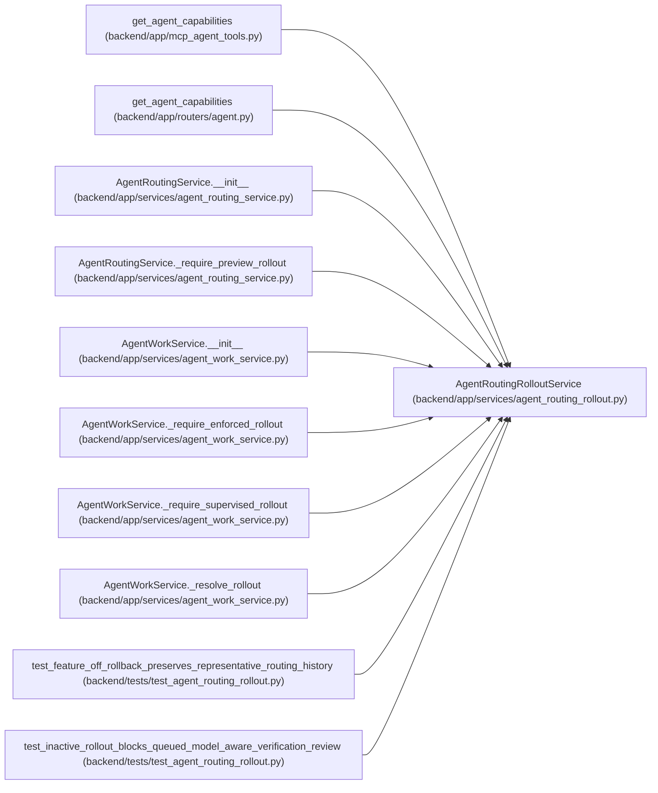

# AgentRoutingRolloutService

**Location:** `backend/app/services/agent_routing_rollout.py:234`
**Kind:** Class
**Bases:** —
**Module:** [agent_routing_rollout](../modules/agent_routing_rollout.md)

## Description

Resolve deployment mode against authoritative topology readiness.

## Attributes

*No annotated attributes found.*

## Methods

| Method | Signature | Decorators | Description |
|--------|-----------|------------|-------------|
| `__init__` | `(*, settings_override: Any \| None = None, topology_readiness: AgentRoutingTopologyReadiness \| None = None)` | — | — |
| `status` | `() -> AgentRoutingRolloutStatus` | — | Return the effective mode, failing closed until topology is ready. |
| `require_preview` | `() -> AgentRoutingRolloutStatus` | — | Permit model-aware previews only in effective shadow/enforced modes. |
| `require_enforced_dispatch` | `() -> AgentRoutingRolloutStatus` | — | Permit enforced dispatch only in the effective enforced mode. |

## Relationships

<!-- Auto-generated relationship summary. Do not edit by hand. -->

### Summary

| Module | Methods | Attributes |
|---|---:|---|
| [agent_routing_rollout](../modules/agent_routing_rollout.md) | 4 | — |

### References

| Reference | Kind | Source | Call sites |
|---|---|---|---:|
| `get_agent_capabilities` | call | [mcp_agent_tools](../modules/mcp_agent_tools.md) | 3 |
| `get_agent_capabilities` | call | [routers_agent](../modules/routers_agent.md) | 3 |
| `AgentRoutingService.__init__` | type_reference | [agent_routing_service](../modules/agent_routing_service.md) | — |
| `AgentRoutingService._require_preview_rollout` | call | [agent_routing_service](../modules/agent_routing_service.md) | 3 |
| `AgentWorkService.__init__` | call | [agent_work_service](../modules/agent_work_service.md) | 1 |
| `AgentWorkService.__init__` | type_reference | [agent_work_service](../modules/agent_work_service.md) | — |
| `AgentWorkService._require_enforced_rollout` | type_reference | [agent_work_service](../modules/agent_work_service.md) | — |
| `AgentWorkService._require_supervised_rollout` | type_reference | [agent_work_service](../modules/agent_work_service.md) | — |
| `AgentWorkService._resolve_rollout` | call | [agent_work_service](../modules/agent_work_service.md) | 1 |
| `AgentWorkService._resolve_rollout` | type_reference | [agent_work_service](../modules/agent_work_service.md) | — |
| `test_feature_off_rollback_preserves_representative_routing_history` | call | [test_agent_routing_rollout](../modules/test_agent_routing_rollout.md) | 2 |
| `test_inactive_rollout_blocks_queued_model_aware_verification_review` | call | [test_agent_routing_rollout](../modules/test_agent_routing_rollout.md) | 1 |

> References: showing 12 of 19 logical references; 7 omitted by the 12-row generated summary limit.
