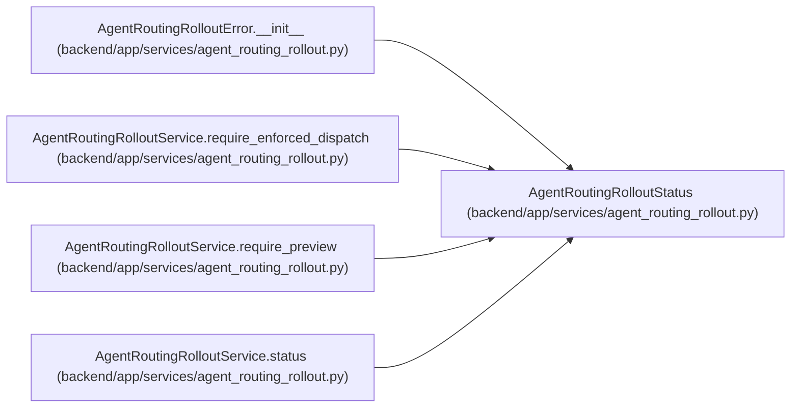

# AgentRoutingRolloutStatus

**Location:** `backend/app/services/agent_routing_rollout.py:204`
**Kind:** Class
**Bases:** —
**Module:** [agent_routing_rollout](../modules/agent_routing_rollout.md)

**Decorators:** `@dataclass(frozen=True)`

## Description

Effective server state after applying fail-closed readiness controls.

## Attributes

| Name | Type | Default | Description |
|------|------|---------|-------------|
| `configured_mode` | `AgentRoutingRolloutMode` | *required* | — |
| `effective_mode` | `AgentRoutingRolloutMode` | *required* | — |
| `feature_advertised` | `bool` | *required* | — |
| `blocker_codes` | `tuple[str, ...]` | *required* | — |
| `topology_readiness` | `AgentRoutingTopologyReadiness` | *required* | — |

## Methods

| Method | Signature | Decorators | Description |
|--------|-----------|------------|-------------|
| `as_dict` | `() -> dict[str, Any]` | — | Return the secret-free REST/MCP capability projection. |

## Relationships

<!-- Auto-generated relationship summary. Do not edit by hand. -->

### Summary

| Module | Methods | Attributes |
|---|---:|---|
| [agent_routing_rollout](../modules/agent_routing_rollout.md) | 1 | `blocker_codes`, `configured_mode`, `effective_mode`, `feature_advertised`, `topology_readiness` |

### References

| Reference | Kind | Source | Call sites |
|---|---|---|---:|
| `AgentRoutingRolloutError.__init__` | type_reference | [agent_routing_rollout](../modules/agent_routing_rollout.md) | — |
| `AgentRoutingRolloutService.require_enforced_dispatch` | type_reference | [agent_routing_rollout](../modules/agent_routing_rollout.md) | — |
| `AgentRoutingRolloutService.require_preview` | type_reference | [agent_routing_rollout](../modules/agent_routing_rollout.md) | — |
| `AgentRoutingRolloutService.status` | call | [agent_routing_rollout](../modules/agent_routing_rollout.md) | 3 |
| `AgentRoutingRolloutService.status` | type_reference | [agent_routing_rollout](../modules/agent_routing_rollout.md) | — |
