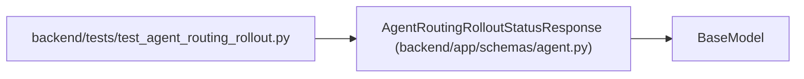

# AgentRoutingRolloutStatusResponse

**Location:** `backend/app/schemas/agent.py:688`
**Kind:** Pydantic model
**Bases:** `BaseModel`
**Module:** [schemas_agent](../modules/schemas_agent.md)

## Description

Explicit configured and effective model-aware routing rollout state.

## Model Configuration

| Setting | Value | Source |
|---------|-------|--------|
| `extra` | `'forbid'` | model_config |

## Attributes

| Name | Type | Wire name | Required | Nullable | Default | Constraints | Examples | Description |
|------|------|-----------|----------|----------|---------|-------------|-------------|----------|
| `configured_mode` | `Literal['off', 'shadow', 'enforced']` | `configured_mode` | Yes | No | — | — | — | — |
| `effective_mode` | `Literal['off', 'shadow', 'enforced']` | `effective_mode` | Yes | No | — | — | — | — |
| `feature_advertised` | `bool` | `feature_advertised` | Yes | No | — | — | — | — |
| `blocker_codes` | `list[str]` | `blocker_codes` | No | No | factory: `list` | max_length=20 | — | — |
| `topology_readiness` | `AgentRoutingTopologyReadinessResponse` | `topology_readiness` | Yes | No | — | — | — | — |

## Methods

*No public methods. Inherits from base classes.*

## Relationships

<!-- Auto-generated relationship summary. Do not edit by hand. -->

### Summary

| Module | Methods | Attributes |
|---|---:|---|
| [schemas_agent](../modules/schemas_agent.md) | 0 | `blocker_codes`, `configured_mode`, `effective_mode`, `feature_advertised`, `topology_readiness` |

### Structure

| Kind | Entity | Module |
|---|---|---|
| Base | `BaseModel` | — |

### References

| Reference | Kind | Source | Call sites |
|---|---|---|---:|
| `test_agent_routing_rollout` | import | [test_agent_routing_rollout](../modules/test_agent_routing_rollout.md) | — |
