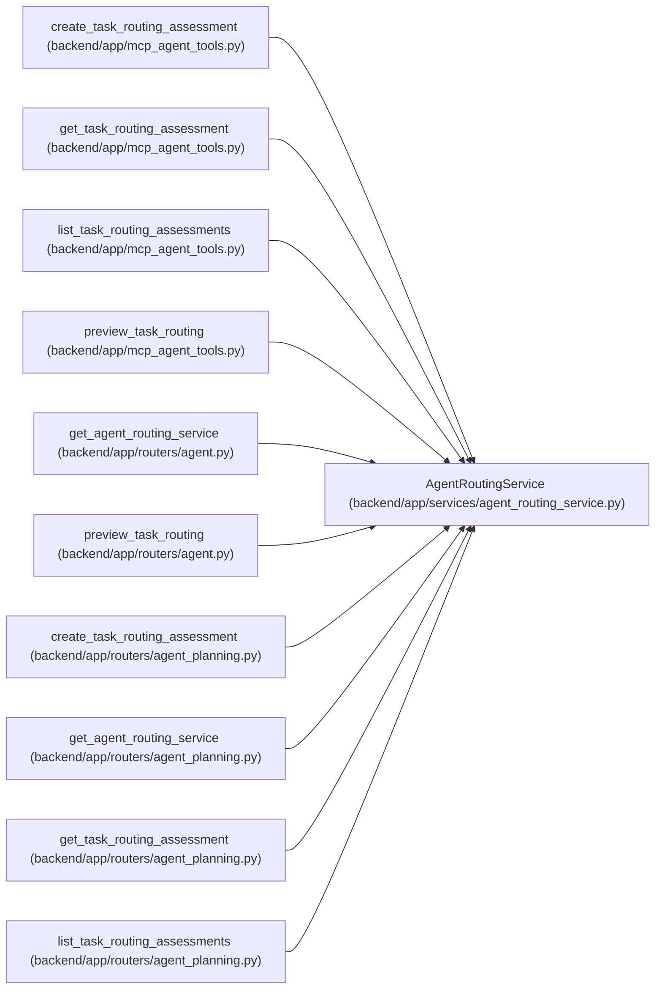

# AgentRoutingService

**Location:** `backend/app/services/agent_routing_service.py:199`
**Kind:** Class
**Bases:** —
**Module:** [agent_routing_service](../modules/agent_routing_service.md)

## Description

Create immutable assessments and deterministic exact-actor previews.

## Attributes

*No annotated attributes found.*

## Methods

| Method | Signature | Decorators | Description |
|--------|-----------|------------|-------------|
| `__init__` | `(db: AsyncSession, *, rollout_service: AgentRoutingRolloutService \| None = None)` | — | — |
| `_require_preview_rollout` | *(async)* `(actor: AgentActor)` | — | Translate fail-closed rollout state into the routing error envelope. |
| `_require_read` | `(actor: AgentActor) -> None` | `@staticmethod` | — |
| `_require_assessment_write` | `(actor: AgentActor) -> None` | `@staticmethod` | — |
| `_task_version` | *(async)* `(task_id: int) -> int` | — | — |
| `_lock_task` | *(async)* `(task_id: int) -> Task \| None` | — | — |
| `lock_selection_inputs` | *(async)* `(task_id: int) -> None` | — | Fence every mutable routing input for an assignment transaction. |
| `_assessment_rows` | *(async)* `(task_id: int, *, limit: int = 100) -> list[TaskRoutingAssessment]` | — | — |
| `get_assessment_state` | *(async)* `(task_id: int, actor: AgentActor) -> TaskRoutingAssessmentState` | — | Return no/current/stale state without conflating old evidence with routeability. |
| `list_assessments` | *(async)* `(task_id: int, actor: AgentActor, *, limit: int = 100) -> TaskRoutingAssessmentListResponse` | — | Return a bounded newest-first append-only assessment history. |
| `_assessment_replay` | *(async)* `(*, actor_id: int, task_id: int, idempotency_key: str, request_payload: dict[str, Any]) -> TaskRoutingAssessmentMutationReceipt \| None` | — | — |
| `create_assessment` | *(async)* `(task_id: int, actor: AgentActor, data: TaskRoutingAssessmentCommand, command: AgentPlanningCommandContext) -> TaskRoutingAssessmentMutationReceipt` | — | Append one server-attributed assessment for the current task version. |
| `_profile_evidence` | `(profile: TeamMemberProfile \| None) -> RoutingProfileEvidence \| None` | `@staticmethod` | — |
| `_profile_revision` | `(profile: TeamMemberProfile \| None) -> str \| None` | `@staticmethod` | — |
| `_task_global_blockers` | `(task: Task, *, purpose: str, task_assignments: Sequence[AgentTaskAssignment], running_runs: Sequence[AgentRun]) -> list[str]` | `@staticmethod` | — |
| `_preview_signing_key` | `() -> bytes` | `@staticmethod` | — |
| `_preview_id` | `(*, generated_at: datetime, task_id: int, assessment_id: int, purpose: str, reviewer_profile_id: int \| None, input_digest: str, requesting_actor_id: int) -> str` | `@classmethod` | — |
| `_parse_preview_id` | `(preview_id: str) -> tuple[datetime, int]` | `@staticmethod` | — |
| `_preview_context` | *(async)* `(task: Task) -> tuple[Iteration, list[TeamMember], list[AgentActor], list[AgentTaskAssignment], list[AgentRun], dict[int, tuple[int, int]], dict[int, int]]` | — | — |
| `_capacity_inputs` | *(async)* `(*, task: Task, iteration: Iteration, members: Sequence[TeamMember]) -> dict[int, dict[str, Any]]` | — | — |
| `_member_for_candidate` | `(*, task: Task, purpose: str, profile_id: int \| None, members: Sequence[TeamMember]) -> TeamMember \| None` | `@staticmethod` | — |
| `_routing_input_evidence` | `(*, task: Task, assessment: TaskRoutingAssessment, purpose: str, reviewer_profile_id: int \| None, iteration: Iteration, members: Sequence[TeamMember], actors: Sequence[AgentActor], task_assignments: Sequence[AgentTaskAssignment], running_task_runs: Sequence[AgentRun], assignment_counts: dict[int, tuple[int, int]], running_counts: dict[int, int], capacity: dict[int, dict[str, Any]]) -> dict[str, Any]` | `@staticmethod` | — |
| `_build_preview` | *(async)* `(*, task: Task, data: AgentRoutingPreviewCreate, generated_at: datetime, requesting_actor_id: int) -> AgentRoutingPreviewResponse` | — | — |
| `preview_task_routing` | *(async)* `(task_id: int, actor: AgentActor, data: AgentRoutingPreviewCreate, *, now: datetime \| None = None) -> AgentRoutingPreviewResponse` | — | Return a deterministic preview and stage bounded shadow/audit evidence. |
| `_completed_prior_lineage` | `(existing_assignment: AgentTaskAssignment \| None, *, selected_reasoning_tier: int, selected_context_tier: str) -> dict[str, Any] \| None` | `@staticmethod` | Compact pending lineage and record the governed tier comparison. |
| `validate_assignment_selection` | *(async)* `(*, task: Task, selected_actor: AgentActor, data: Any, existing_assignment: AgentTaskAssignment \| None = None, task_assignments: Sequence[AgentTaskAssignment] \| None = None, assignment_created_by_actor: AgentActor \| None = None, now: datetime \| None = None, selection_inputs_locked: bool = False) -> RoutingSelectionValidation` | — | Recompute and freeze one preview selection inside an assignment transaction. |

## Relationships

<!-- Auto-generated relationship summary. Do not edit by hand. -->

### Summary

| Module | Methods | Attributes |
|---|---:|---|
| [agent_routing_service](../modules/agent_routing_service.md) | 26 | — |

### References

| Reference | Kind | Source | Call sites |
|---|---|---|---:|
| `create_task_routing_assessment` | call | [mcp_agent_tools](../modules/mcp_agent_tools.md) | 1 |
| `get_task_routing_assessment` | call | [mcp_agent_tools](../modules/mcp_agent_tools.md) | 1 |
| `list_task_routing_assessments` | call | [mcp_agent_tools](../modules/mcp_agent_tools.md) | 1 |
| `preview_task_routing` | call | [mcp_agent_tools](../modules/mcp_agent_tools.md) | 1 |
| `get_agent_routing_service` | call | [routers_agent](../modules/routers_agent.md) | 1 |
| `get_agent_routing_service` | type_reference | [routers_agent](../modules/routers_agent.md) | — |
| `preview_task_routing` | type_reference | [routers_agent](../modules/routers_agent.md) | — |
| `create_task_routing_assessment` | type_reference | [routers_agent_planning](../modules/routers_agent_planning.md) | — |
| `get_agent_routing_service` | call | [routers_agent_planning](../modules/routers_agent_planning.md) | 1 |
| `get_agent_routing_service` | type_reference | [routers_agent_planning](../modules/routers_agent_planning.md) | — |
| `get_task_routing_assessment` | type_reference | [routers_agent_planning](../modules/routers_agent_planning.md) | — |
| `list_task_routing_assessments` | type_reference | [routers_agent_planning](../modules/routers_agent_planning.md) | — |

> References: showing 12 of 25 logical references; 13 omitted by the 12-row generated summary limit.
