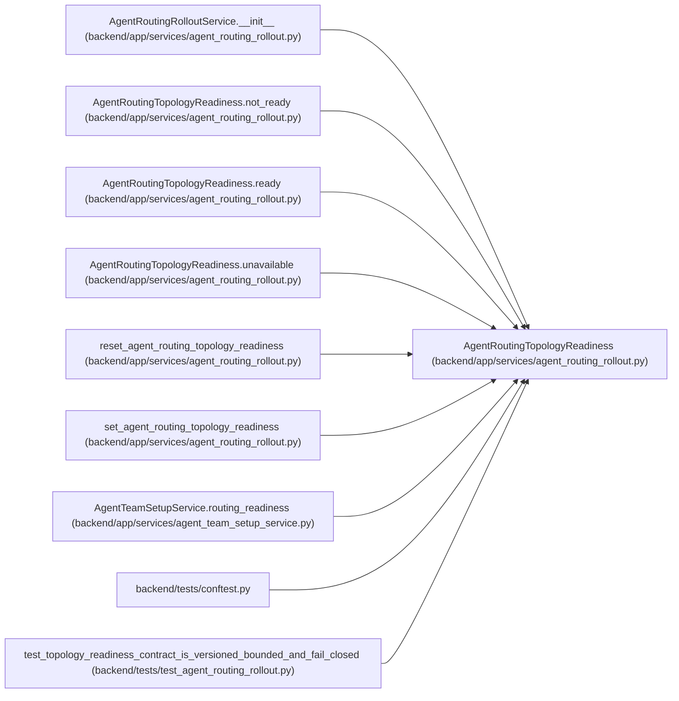

# AgentRoutingTopologyReadiness

**Location:** `backend/app/services/agent_routing_rollout.py:46`
**Kind:** Class
**Bases:** —
**Module:** [agent_routing_rollout](../modules/agent_routing_rollout.md)

**Decorators:** `@dataclass(frozen=True)`

## Description

Narrow, secret-free input supplied by a server-side topology authority.

## Attributes

| Name | Type | Default | Description |
|------|------|---------|-------------|
| `schema_version` | `str` | `TOPOLOGY_READINESS_SCHEMA_VERSION` | — |
| `status` | `AgentRoutingTopologyReadinessStatus` | `AgentRoutingTopologyReadinessStatus.UNAVAILABLE` | — |
| `source` | `AgentRoutingTopologyReadinessSource` | `AgentRoutingTopologyReadinessSource.UNAVAILABLE` | — |
| `topology_id` | `str \| None` | `None` | — |
| `topology_revision` | `int \| None` | `None` | — |
| `blocker_codes` | `tuple[str, ...]` | `('topology_readiness_unavailable',)` | — |

## Methods

| Method | Signature | Decorators | Description |
|--------|-----------|------------|-------------|
| `__post_init__` | `() -> None` | — | — |
| `unavailable` | `() -> 'AgentRoutingTopologyReadiness'` | `@classmethod` | Return the pre-setup fail-closed readiness input. |
| `not_ready` | `(*, topology_id: str, topology_revision: int, blocker_codes: tuple[str, ...]) -> 'AgentRoutingTopologyReadiness'` | `@classmethod` | Return an authoritative but unsatisfied topology input. |
| `ready` | `(*, topology_id: str, topology_revision: int) -> 'AgentRoutingTopologyReadiness'` | `@classmethod` | Return a satisfied topology input from the setup authority. |
| `as_dict` | `() -> dict[str, Any]` | — | Project the bounded input into the public capability status. |

## Relationships

<!-- Auto-generated relationship summary. Do not edit by hand. -->

### Summary

| Module | Methods | Attributes |
|---|---:|---|
| [agent_routing_rollout](../modules/agent_routing_rollout.md) | 5 | `blocker_codes`, `schema_version`, `source`, `status`, `topology_id`, `topology_revision` |

### References

| Reference | Kind | Source | Call sites |
|---|---|---|---:|
| `AgentRoutingRolloutService.__init__` | type_reference | [agent_routing_rollout](../modules/agent_routing_rollout.md) | — |
| `AgentRoutingTopologyReadiness.not_ready` | call | [agent_routing_rollout](../modules/agent_routing_rollout.md) | 1 |
| `AgentRoutingTopologyReadiness.not_ready` | type_reference | [agent_routing_rollout](../modules/agent_routing_rollout.md) | — |
| `AgentRoutingTopologyReadiness.ready` | call | [agent_routing_rollout](../modules/agent_routing_rollout.md) | 1 |
| `AgentRoutingTopologyReadiness.ready` | type_reference | [agent_routing_rollout](../modules/agent_routing_rollout.md) | — |
| `AgentRoutingTopologyReadiness.unavailable` | call | [agent_routing_rollout](../modules/agent_routing_rollout.md) | 1 |
| `AgentRoutingTopologyReadiness.unavailable` | type_reference | [agent_routing_rollout](../modules/agent_routing_rollout.md) | — |
| `reset_agent_routing_topology_readiness` | type_reference | [agent_routing_rollout](../modules/agent_routing_rollout.md) | — |
| `set_agent_routing_topology_readiness` | type_reference | [agent_routing_rollout](../modules/agent_routing_rollout.md) | — |
| `AgentTeamSetupService.routing_readiness` | type_reference | [agent_team_setup_service](../modules/agent_team_setup_service.md) | — |
| `conftest` | import | [conftest](../modules/conftest.md) | — |
| `test_topology_readiness_contract_is_versioned_bounded_and_fail_closed` | call | [test_agent_routing_rollout](../modules/test_agent_routing_rollout.md) | 1 |

> References: showing 12 of 13 logical references; 1 omitted by the 12-row generated summary limit.
