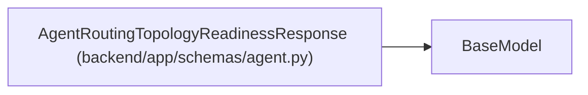

# AgentRoutingTopologyReadinessResponse

**Location:** `backend/app/schemas/agent.py:670`
**Kind:** Pydantic model
**Bases:** `BaseModel`
**Module:** [schemas_agent](../modules/schemas_agent.md)

## Description

Bounded server-owned topology readiness exposed to agent clients.

## Model Configuration

| Setting | Value | Source |
|---------|-------|--------|
| `extra` | `'forbid'` | model_config |

## Attributes

| Name | Type | Wire name | Required | Nullable | Default | Constraints | Examples | Description |
|------|------|-----------|----------|----------|---------|-------------|-------------|----------|
| `schema_version` | `Literal['model-aware-routing-topology-readiness-v1']` | `schema_version` | Yes | No | — | — | — | — |
| `status` | `Literal['unavailable', 'not_ready', 'ready']` | `status` | Yes | No | — | — | — | — |
| `source` | `Literal['unavailable', 'agent-team-master-v1']` | `source` | Yes | No | — | — | — | — |
| `topology_id` | `Optional[str]` | `topology_id` | No | Yes | `None` | min_length=1; max_length=100; pattern='^[A-Za-z0-9][A-Za-z0-9._:-]{0,99}$' | — | — |
| `topology_revision` | `Optional[int]` | `topology_revision` | No | Yes | `None` | ge=1 | — | — |
| `blocker_codes` | `list[str]` | `blocker_codes` | No | No | factory: `list` | max_length=20 | — | — |

## Methods

*No public methods. Inherits from base classes.*

## Relationships

<!-- Auto-generated relationship summary. Do not edit by hand. -->

### Summary

| Module | Methods | Attributes |
|---|---:|---|
| [schemas_agent](../modules/schemas_agent.md) | 0 | `blocker_codes`, `schema_version`, `source`, `status`, `topology_id`, `topology_revision` |

### Structure

| Kind | Entity | Module |
|---|---|---|
| Base | `BaseModel` | — |
