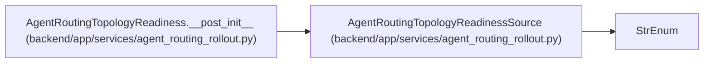

# AgentRoutingTopologyReadinessSource

**Location:** `backend/app/services/agent_routing_rollout.py:38`
**Kind:** Enum
**Bases:** `StrEnum`
**Module:** [agent_routing_rollout](../modules/agent_routing_rollout.md)

## Description

Closed authorities allowed to supply topology readiness.

## Attributes

| Name | Declared value | Description |
|------|-------|-------------|
| `UNAVAILABLE` | `'unavailable'` | — |
| `AGENT_TEAM_MASTER` | `'agent-team-master-v1'` | — |

## Methods

*No public methods. Inherits from base classes.*

## Relationships

<!-- Auto-generated relationship summary. Do not edit by hand. -->

### Summary

| Module | Methods | Attributes |
|---|---:|---|
| [agent_routing_rollout](../modules/agent_routing_rollout.md) | 0 | `AGENT_TEAM_MASTER`, `UNAVAILABLE` |

### Structure

| Kind | Entity | Module |
|---|---|---|
| Base | `StrEnum` | — |

### References

| Reference | Kind | Source | Call sites |
|---|---|---|---:|
| `AgentRoutingTopologyReadiness.__post_init__` | call | [agent_routing_rollout](../modules/agent_routing_rollout.md) | 1 |
