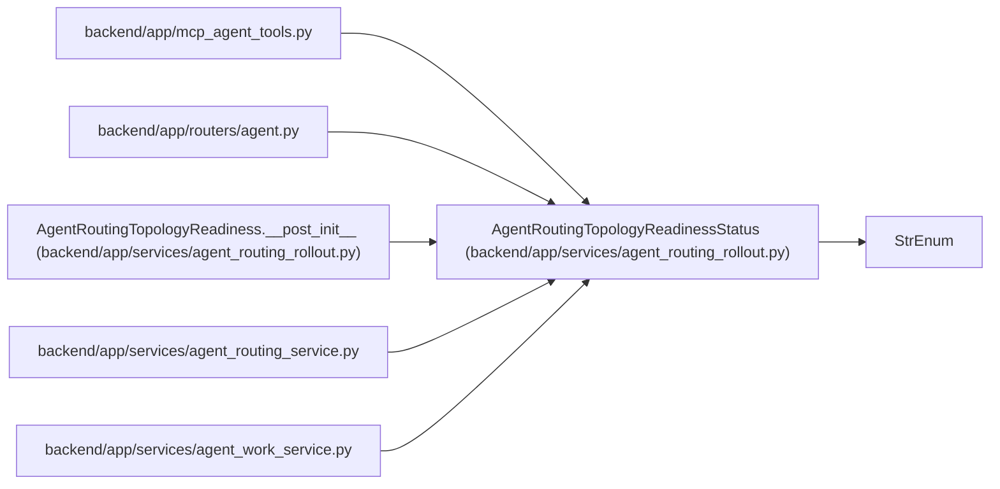

# AgentRoutingTopologyReadinessStatus

**Location:** `backend/app/services/agent_routing_rollout.py:30`
**Kind:** Enum
**Bases:** `StrEnum`
**Module:** [agent_routing_rollout](../modules/agent_routing_rollout.md)

## Description

Closed readiness states supplied by the setup authority.

## Attributes

| Name | Declared value | Description |
|------|-------|-------------|
| `UNAVAILABLE` | `'unavailable'` | — |
| `NOT_READY` | `'not_ready'` | — |
| `READY` | `'ready'` | — |

## Methods

*No public methods. Inherits from base classes.*

## Relationships

<!-- Auto-generated relationship summary. Do not edit by hand. -->

### Summary

| Module | Methods | Attributes |
|---|---:|---|
| [agent_routing_rollout](../modules/agent_routing_rollout.md) | 0 | `NOT_READY`, `READY`, `UNAVAILABLE` |

### Structure

| Kind | Entity | Module |
|---|---|---|
| Base | `StrEnum` | — |

### References

| Reference | Kind | Source | Call sites |
|---|---|---|---:|
| `mcp_agent_tools` | import | [mcp_agent_tools](../modules/mcp_agent_tools.md) | — |
| `agent` | import | [routers_agent](../modules/routers_agent.md) | — |
| `AgentRoutingTopologyReadiness.__post_init__` | call | [agent_routing_rollout](../modules/agent_routing_rollout.md) | 1 |
| `agent_routing_service` | import | [agent_routing_service](../modules/agent_routing_service.md) | — |
| `agent_work_service` | import | [agent_work_service](../modules/agent_work_service.md) | — |
