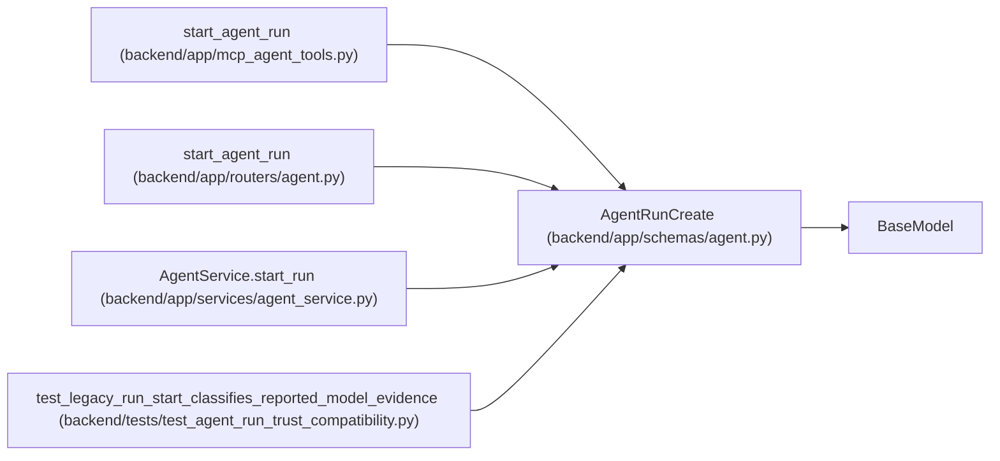

# AgentRunCreate

**Location:** `backend/app/schemas/agent.py:311`
**Kind:** Pydantic model
**Bases:** `BaseModel`
**Module:** [schemas_agent](../modules/schemas_agent.md)

## Description

Request to start an agent run.

## Validators

| Method | Scope | Fields | Mode | Options |
|--------|-------|--------|------|---------|
| `validate_artifact_links` | field | artifact_links | after | — |
| `validate_urls` | field | commit_url, pr_url | after | — |
| `validate_metadata_size` | field | metadata | after | — |

## Attributes

| Name | Type | Wire name | Required | Nullable | Default | Constraints | Examples | Description |
|------|------|-----------|----------|----------|---------|-------------|-------------|----------|
| `task_id` | `Optional[int]` | `task_id` | No | Yes | `None` | — | — | — |
| `assignment_id` | `Optional[int]` | `assignment_id` | No | Yes | `None` | — | — | — |
| `claim_generation` | `Optional[int]` | `claim_generation` | No | Yes | `None` | ge=1 | — | — |
| `trace_id` | `Optional[str]` | `trace_id` | No | Yes | `None` | max_length=255 | — | — |
| `model` | `Optional[str]` | `model` | No | Yes | `None` | max_length=255 | — | — |
| `tool_name` | `Optional[str]` | `tool_name` | No | Yes | `None` | max_length=255 | — | — |
| `metadata` | `dict[str, Any]` | `metadata` | No | No | factory: `dict` | max_length=unknown (MAX_AGENT_JSON_FIELDS) | — | — |
| `artifact_links` | `list[str]` | `artifact_links` | No | No | factory: `list` | max_length=unknown (MAX_AGENT_ARTIFACT_LINKS) | — | — |
| `commit_url` | `Optional[str]` | `commit_url` | No | Yes | `None` | max_length=1000 | — | — |
| `pr_url` | `Optional[str]` | `pr_url` | No | Yes | `None` | max_length=1000 | — | — |

## Methods

| Method | Signature | Decorators | Description |
|--------|-----------|------------|-------------|
| `validate_artifact_links` | `(value: list[str]) -> list[str]` | `@field_validator('artifact_links')`, `@classmethod` | — |
| `validate_urls` | `(value: Optional[str]) -> Optional[str]` | `@field_validator('commit_url', 'pr_url')`, `@classmethod` | — |
| `validate_metadata_size` | `(value: dict[str, Any]) -> dict[str, Any]` | `@field_validator('metadata')`, `@classmethod` | — |

## Relationships

<!-- Auto-generated relationship summary. Do not edit by hand. -->

### Summary

| Module | Methods | Attributes |
|---|---:|---|
| [schemas_agent](../modules/schemas_agent.md) | 3 | `artifact_links`, `assignment_id`, `claim_generation`, `commit_url`, `metadata`, `model`, `pr_url`, `task_id`, `tool_name`, `trace_id` |

### Structure

| Kind | Entity | Module |
|---|---|---|
| Base | `BaseModel` | — |

### References

| Reference | Kind | Source | Call sites |
|---|---|---|---:|
| `start_agent_run` | call | [mcp_agent_tools](../modules/mcp_agent_tools.md) | 1 |
| `start_agent_run` | type_reference | [routers_agent](../modules/routers_agent.md) | — |
| `AgentService.start_run` | type_reference | [agent_service](../modules/agent_service.md) | — |
| `test_legacy_run_start_classifies_reported_model_evidence` | call | [test_agent_run_trust_compatibility](../modules/test_agent_run_trust_compatibility.md) | 1 |
