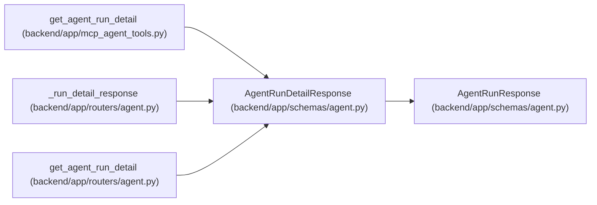

# AgentRunDetailResponse

**Location:** `backend/app/schemas/agent.py:487`
**Kind:** Pydantic model
**Bases:** `AgentRunResponse`
**Module:** [schemas_agent](../modules/schemas_agent.md)

## Description

Full detail of an agent run including its list of chronological trace events.

## Attributes

| Name | Type | Wire name | Required | Nullable | Default | Constraints | Examples | Description |
|------|------|-----------|----------|----------|---------|-------------|-------------|----------|
| `events` | `list[AgentRunEventResponse]` | `events` | No | No | `[]` | — | — | — |

## Methods

*No public methods. Inherits from base classes.*

## Relationships

<!-- Auto-generated relationship summary. Do not edit by hand. -->

### Summary

| Module | Methods | Attributes |
|---|---:|---|
| [schemas_agent](../modules/schemas_agent.md) | 0 | `events` |

### Structure

| Kind | Entity | Module |
|---|---|---|
| Base | `AgentRunResponse` | [schemas_agent](../modules/schemas_agent.md) |

### References

| Reference | Kind | Source | Call sites |
|---|---|---|---:|
| `get_agent_run_detail` | call | [mcp_agent_tools](../modules/mcp_agent_tools.md) | 1 |
| `_run_detail_response` | call | [routers_agent](../modules/routers_agent.md) | 1 |
| `_run_detail_response` | type_reference | [routers_agent](../modules/routers_agent.md) | — |
| `get_agent_run_detail` | type_reference | [routers_agent](../modules/routers_agent.md) | — |
