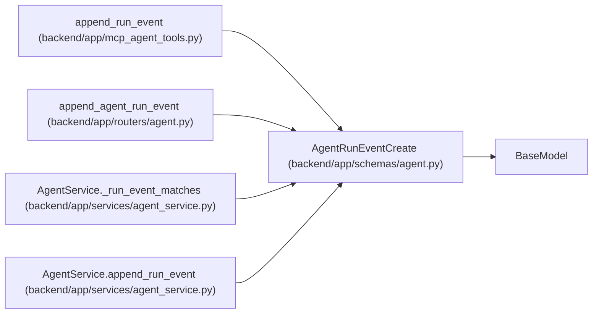

# AgentRunEventCreate

**Location:** `backend/app/schemas/agent.py:344`
**Kind:** Pydantic model
**Bases:** `BaseModel`
**Module:** [schemas_agent](../modules/schemas_agent.md)

## Description

Request to append an agent run event.

## Model Configuration

| Setting | Value | Source |
|---------|-------|--------|
| `extra` | `'forbid'` | model_config |

## Validators

| Method | Scope | Fields | Mode | Options |
|--------|-------|--------|------|---------|
| `validate_payload_size` | field | payload | after | — |

## Attributes

| Name | Type | Wire name | Required | Nullable | Default | Constraints | Examples | Description |
|------|------|-----------|----------|----------|---------|-------------|-------------|----------|
| `event_type` | `str` | `event_type` | Yes | No | — | min_length=1; max_length=100 | — | — |
| `message` | `Optional[str]` | `message` | No | Yes | `None` | max_length=unknown (MAX_AGENT_EVENT_MESSAGE_LENGTH) | — | — |
| `payload` | `dict[str, Any]` | `payload` | No | No | factory: `dict` | max_length=unknown (MAX_AGENT_JSON_FIELDS) | — | — |
| `trace_id` | `Optional[str]` | `trace_id` | No | Yes | `None` | max_length=255 | — | — |
| `span_id` | `Optional[str]` | `span_id` | No | Yes | `None` | max_length=255 | — | — |
| `correlation_id` | `Optional[str]` | `correlation_id` | No | Yes | `None` | max_length=255 | — | — |
| `idempotency_key` | `Optional[str]` | `idempotency_key` | No | Yes | `None` | max_length=255 | — | — |
| `claim_id` | `Optional[str]` | `claim_id` | No | Yes | `None` | min_length=16; max_length=64 | — | — |
| `claim_generation` | `Optional[int]` | `claim_generation` | No | Yes | `None` | ge=1 | — | — |

## Methods

| Method | Signature | Decorators | Description |
|--------|-----------|------------|-------------|
| `validate_payload_size` | `(value: dict[str, Any]) -> dict[str, Any]` | `@field_validator('payload')`, `@classmethod` | — |

## Relationships

<!-- Auto-generated relationship summary. Do not edit by hand. -->

### Summary

| Module | Methods | Attributes |
|---|---:|---|
| [schemas_agent](../modules/schemas_agent.md) | 1 | `claim_generation`, `claim_id`, `correlation_id`, `event_type`, `idempotency_key`, `message`, `payload`, `span_id`, `trace_id` |

### Structure

| Kind | Entity | Module |
|---|---|---|
| Base | `BaseModel` | — |

### References

| Reference | Kind | Source | Call sites |
|---|---|---|---:|
| `append_run_event` | call | [mcp_agent_tools](../modules/mcp_agent_tools.md) | 1 |
| `append_agent_run_event` | type_reference | [routers_agent](../modules/routers_agent.md) | — |
| `AgentService._run_event_matches` | type_reference | [agent_service](../modules/agent_service.md) | — |
| `AgentService.append_run_event` | type_reference | [agent_service](../modules/agent_service.md) | — |
