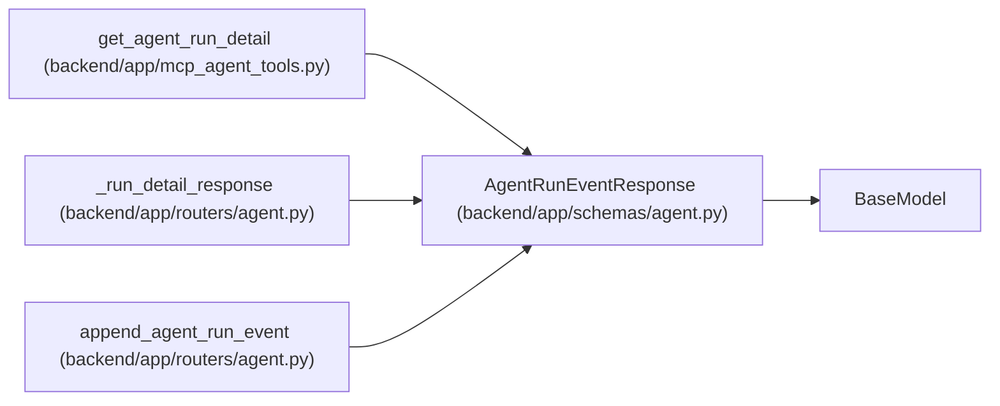

# AgentRunEventResponse

**Location:** `backend/app/schemas/agent.py:390`
**Kind:** Pydantic model
**Bases:** `BaseModel`
**Module:** [schemas_agent](../modules/schemas_agent.md)

## Description

Agent run event response.

## Attributes

| Name | Type | Wire name | Required | Nullable | Default | Constraints | Examples | Description |
|------|------|-----------|----------|----------|---------|-------------|-------------|----------|
| `id` | `int` | `id` | Yes | No | — | — | — | — |
| `run_id` | `int` | `run_id` | Yes | No | — | — | — | — |
| `event_type` | `str` | `event_type` | Yes | No | — | — | — | — |
| `message` | `Optional[str]` | `message` | No | Yes | `None` | — | — | — |
| `payload` | `dict[str, Any]` | `payload` | Yes | No | — | — | — | — |
| `trace_id` | `Optional[str]` | `trace_id` | No | Yes | `None` | — | — | — |
| `span_id` | `Optional[str]` | `span_id` | No | Yes | `None` | — | — | — |
| `correlation_id` | `Optional[str]` | `correlation_id` | No | Yes | `None` | — | — | — |
| `idempotency_key` | `Optional[str]` | `idempotency_key` | No | Yes | `None` | — | — | — |
| `created_at` | `datetime` | `created_at` | Yes | No | — | — | — | — |

## Methods

*No public methods. Inherits from base classes.*

## Relationships

<!-- Auto-generated relationship summary. Do not edit by hand. -->

### Summary

| Module | Methods | Attributes |
|---|---:|---|
| [schemas_agent](../modules/schemas_agent.md) | 0 | `correlation_id`, `created_at`, `event_type`, `id`, `idempotency_key`, `message`, `payload`, `run_id`, `span_id`, `trace_id` |

### Structure

| Kind | Entity | Module |
|---|---|---|
| Base | `BaseModel` | — |

### References

| Reference | Kind | Source | Call sites |
|---|---|---|---:|
| `get_agent_run_detail` | call | [mcp_agent_tools](../modules/mcp_agent_tools.md) | 1 |
| `_run_detail_response` | call | [routers_agent](../modules/routers_agent.md) | 1 |
| `append_agent_run_event` | call | [routers_agent](../modules/routers_agent.md) | 1 |
| `append_agent_run_event` | type_reference | [routers_agent](../modules/routers_agent.md) | — |
