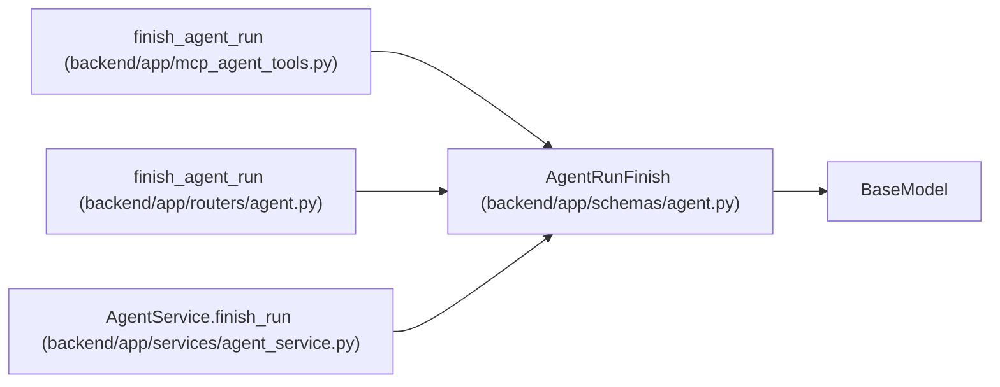

# AgentRunFinish

**Location:** `backend/app/schemas/agent.py:368`
**Kind:** Pydantic model
**Bases:** `BaseModel`
**Module:** [schemas_agent](../modules/schemas_agent.md)

## Description

Request to finish an agent run.

## Validators

| Method | Scope | Fields | Mode | Options |
|--------|-------|--------|------|---------|
| `validate_artifact_links` | field | artifact_links | after | — |
| `validate_urls` | field | commit_url, pr_url | after | — |

## Attributes

| Name | Type | Wire name | Required | Nullable | Default | Constraints | Examples | Description |
|------|------|-----------|----------|----------|---------|-------------|-------------|----------|
| `status` | `Literal['succeeded', 'failed', 'canceled']` | `status` | Yes | No | — | — | — | — |
| `summary` | `Optional[str]` | `summary` | No | Yes | `None` | max_length=unknown (MAX_AGENT_TEXT_LENGTH) | — | — |
| `error` | `Optional[str]` | `error` | No | Yes | `None` | max_length=unknown (MAX_AGENT_TEXT_LENGTH) | — | — |
| `artifact_links` | `list[str]` | `artifact_links` | No | No | factory: `list` | max_length=unknown (MAX_AGENT_ARTIFACT_LINKS) | — | — |
| `commit_url` | `Optional[str]` | `commit_url` | No | Yes | `None` | max_length=1000 | — | — |
| `pr_url` | `Optional[str]` | `pr_url` | No | Yes | `None` | max_length=1000 | — | — |

## Methods

| Method | Signature | Decorators | Description |
|--------|-----------|------------|-------------|
| `validate_artifact_links` | `(value: list[str]) -> list[str]` | `@field_validator('artifact_links')`, `@classmethod` | — |
| `validate_urls` | `(value: Optional[str]) -> Optional[str]` | `@field_validator('commit_url', 'pr_url')`, `@classmethod` | — |

## Relationships

<!-- Auto-generated relationship summary. Do not edit by hand. -->

### Summary

| Module | Methods | Attributes |
|---|---:|---|
| [schemas_agent](../modules/schemas_agent.md) | 2 | `artifact_links`, `commit_url`, `error`, `pr_url`, `status`, `summary` |

### Structure

| Kind | Entity | Module |
|---|---|---|
| Base | `BaseModel` | — |

### References

| Reference | Kind | Source | Call sites |
|---|---|---|---:|
| `finish_agent_run` | call | [mcp_agent_tools](../modules/mcp_agent_tools.md) | 1 |
| `finish_agent_run` | type_reference | [routers_agent](../modules/routers_agent.md) | — |
| `AgentService.finish_run` | type_reference | [agent_service](../modules/agent_service.md) | — |
