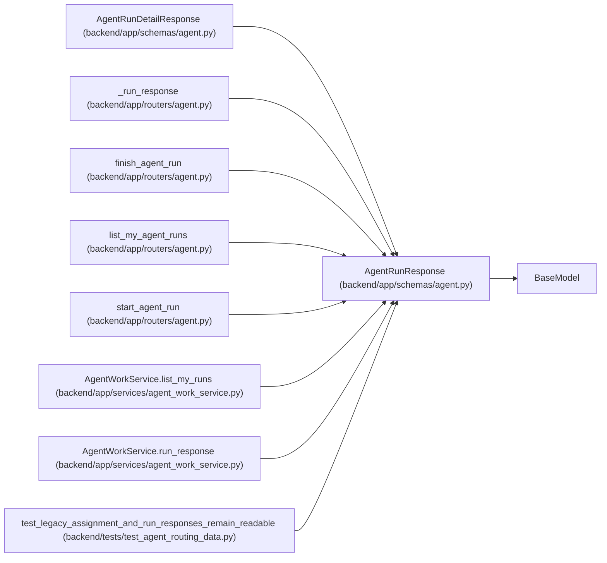

# AgentRunResponse

**Location:** `backend/app/schemas/agent.py:404`
**Kind:** Pydantic model
**Bases:** `BaseModel`
**Module:** [schemas_agent](../modules/schemas_agent.md)

## Description

Agent run response.

## Attributes

| Name | Type | Wire name | Required | Nullable | Default | Constraints | Examples | Description |
|------|------|-----------|----------|----------|---------|-------------|-------------|----------|
| `id` | `int` | `id` | Yes | No | — | — | — | — |
| `task_id` | `Optional[int]` | `task_id` | Yes | Yes | — | — | — | — |
| `actor_id` | `int` | `actor_id` | Yes | No | — | — | — | — |
| `assignment_id` | `Optional[int]` | `assignment_id` | No | Yes | `None` | — | — | — |
| `claim_generation` | `Optional[int]` | `claim_generation` | No | Yes | `None` | — | — | — |
| `status` | `str` | `status` | Yes | No | — | — | — | — |
| `trace_id` | `Optional[str]` | `trace_id` | No | Yes | `None` | — | — | — |
| `model_binding_id` | `Optional[int]` | `model_binding_id` | No | Yes | `None` | — | — | — |
| `model_binding_revision` | `Optional[int]` | `model_binding_revision` | No | Yes | `None` | — | — | — |
| `configured_model_alias` | `Optional[str]` | `configured_model_alias` | No | Yes | `None` | — | — | — |
| `resolved_model_id` | `Optional[str]` | `resolved_model_id` | No | Yes | `None` | — | — | — |
| `model_trust_state` | `Literal['matched', 'mismatch', 'unreported', 'unverifiable']` | `model_trust_state` | No | No | `'unreported'` | — | — | Configured-versus-reported comparison only; matched worker self-report is not launcher attestation. |
| `model_match_basis` | `Optional[Literal['configured_alias', 'catalog_key']]` | `model_match_basis` | No | Yes | `None` | — | — | — |
| `model` | `Optional[str]` | `model` | No | Yes | `None` | — | — | — |
| `tool_name` | `Optional[str]` | `tool_name` | No | Yes | `None` | — | — | — |
| `metadata` | `dict[str, Any]` | `metadata` | Yes | No | — | — | — | — |
| `artifact_links` | `list[str]` | `artifact_links` | Yes | No | — | — | — | — |
| `commit_url` | `Optional[str]` | `commit_url` | No | Yes | `None` | — | — | — |
| `pr_url` | `Optional[str]` | `pr_url` | No | Yes | `None` | — | — | — |
| `summary` | `Optional[str]` | `summary` | No | Yes | `None` | — | — | — |
| `error` | `Optional[str]` | `error` | No | Yes | `None` | — | — | — |
| `started_at` | `datetime` | `started_at` | Yes | No | — | — | — | — |
| `ended_at` | `Optional[datetime]` | `ended_at` | No | Yes | `None` | — | — | — |
| `heartbeat_at` | `Optional[datetime]` | `heartbeat_at` | No | Yes | `None` | — | — | — |

## Methods

*No public methods. Inherits from base classes.*

## Relationships

<!-- Auto-generated relationship summary. Do not edit by hand. -->

### Summary

| Module | Methods | Attributes |
|---|---:|---|
| [schemas_agent](../modules/schemas_agent.md) | 0 | `actor_id`, `artifact_links`, `assignment_id`, `claim_generation`, `commit_url`, `configured_model_alias`, `ended_at`, `error`, `heartbeat_at`, `id`, `metadata`, `model` |

### Structure

| Kind | Entity | Module |
|---|---|---|
| Base | `BaseModel` | — |
| Subclass | `AgentRunDetailResponse` | [schemas_agent](../modules/schemas_agent.md) |

### References

| Reference | Kind | Source | Call sites |
|---|---|---|---:|
| `_run_response` | call | [routers_agent](../modules/routers_agent.md) | 1 |
| `_run_response` | type_reference | [routers_agent](../modules/routers_agent.md) | — |
| `finish_agent_run` | type_reference | [routers_agent](../modules/routers_agent.md) | — |
| `list_my_agent_runs` | type_reference | [routers_agent](../modules/routers_agent.md) | — |
| `start_agent_run` | type_reference | [routers_agent](../modules/routers_agent.md) | — |
| `AgentWorkService.list_my_runs` | type_reference | [agent_work_service](../modules/agent_work_service.md) | — |
| `AgentWorkService.run_response` | call | [agent_work_service](../modules/agent_work_service.md) | 1 |
| `AgentWorkService.run_response` | type_reference | [agent_work_service](../modules/agent_work_service.md) | — |
| `test_legacy_assignment_and_run_responses_remain_readable` | call | [test_agent_routing_data](../modules/test_agent_routing_data.md) | 1 |
