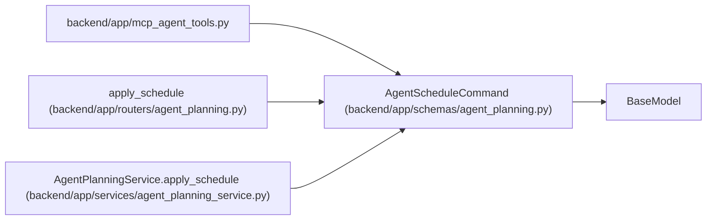

# AgentScheduleCommand

**Location:** `backend/app/schemas/agent_planning.py:46`
**Kind:** Pydantic model
**Bases:** `BaseModel`
**Module:** [schemas_agent_planning](../modules/schemas_agent_planning.md)

## Description

Optimistic scheduling command bound to observed task versions.

## Model Configuration

| Setting | Value | Source |
|---------|-------|--------|
| `extra` | `'forbid'` | model_config |

## Validators

| Method | Scope | Fields | Mode | Options |
|--------|-------|--------|------|---------|
| `validate_versions` | field | expected_task_versions | after | — |

## Attributes

| Name | Type | Wire name | Required | Nullable | Default | Constraints | Examples | Description |
|------|------|-----------|----------|----------|---------|-------------|-------------|----------|
| `expected_task_versions` | `dict[int, int]` | `expected_task_versions` | No | No | factory: `dict` | — | — | — |
| `expected_input_digest` | `str` | `expected_input_digest` | Yes | No | — | min_length=64; max_length=64; pattern='^[0-9a-f]{64}$' | — | — |

## Methods

| Method | Signature | Decorators | Description |
|--------|-----------|------------|-------------|
| `validate_versions` | `(value: dict[int, int]) -> dict[int, int]` | `@field_validator('expected_task_versions')`, `@classmethod` | Require positive task ids and non-negative optimistic versions. |

## Relationships

<!-- Auto-generated relationship summary. Do not edit by hand. -->

### Summary

| Module | Methods | Attributes |
|---|---:|---|
| [schemas_agent_planning](../modules/schemas_agent_planning.md) | 1 | `expected_input_digest`, `expected_task_versions` |

### Structure

| Kind | Entity | Module |
|---|---|---|
| Base | `BaseModel` | — |

### References

| Reference | Kind | Source | Call sites |
|---|---|---|---:|
| `mcp_agent_tools` | import | [mcp_agent_tools](../modules/mcp_agent_tools.md) | — |
| `apply_schedule` | type_reference | [routers_agent_planning](../modules/routers_agent_planning.md) | — |
| `AgentPlanningService.apply_schedule` | type_reference | [agent_planning_service](../modules/agent_planning_service.md) | — |
