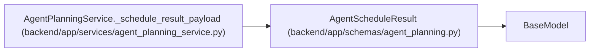

# AgentScheduleResult

**Location:** `backend/app/schemas/agent_planning.py:80`
**Kind:** Pydantic model
**Bases:** `BaseModel`
**Module:** [schemas_agent_planning](../modules/schemas_agent_planning.md)

## Description

Schedule outcome plus the complete optimistic task-version token set.

## Attributes

| Name | Type | Wire name | Required | Nullable | Default | Constraints | Examples | Description |
|------|------|-----------|----------|----------|---------|-------------|-------------|----------|
| `success` | `bool` | `success` | Yes | No | — | — | — | — |
| `decisions` | `list[dict[str, Any]]` | `decisions` | No | No | factory: `list` | — | — | — |
| `workload_balanced` | `bool` | `workload_balanced` | No | No | `True` | — | — | — |
| `workload_issues` | `list[dict[str, Any]]` | `workload_issues` | No | No | factory: `list` | — | — | — |
| `input_digest` | `str` | `input_digest` | Yes | No | — | max_length=64; min_length=64 | — | — |
| `task_states` | `list[AgentScheduleTaskState]` | `task_states` | No | No | factory: `list` | — | — | — |

## Methods

*No public methods. Inherits from base classes.*

## Relationships

<!-- Auto-generated relationship summary. Do not edit by hand. -->

### Summary

| Module | Methods | Attributes |
|---|---:|---|
| [schemas_agent_planning](../modules/schemas_agent_planning.md) | 0 | `decisions`, `input_digest`, `success`, `task_states`, `workload_balanced`, `workload_issues` |

### Structure

| Kind | Entity | Module |
|---|---|---|
| Base | `BaseModel` | — |

### References

| Reference | Kind | Source | Call sites |
|---|---|---|---:|
| `AgentPlanningService._schedule_result_payload` | call | [agent_planning_service](../modules/agent_planning_service.md) | 1 |
