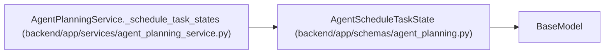

# AgentScheduleTaskState

**Location:** `backend/app/schemas/agent_planning.py:70`
**Kind:** Pydantic model
**Bases:** `BaseModel`
**Module:** [schemas_agent_planning](../modules/schemas_agent_planning.md)

## Description

One task state produced by schedule preview or apply.

## Attributes

| Name | Type | Wire name | Required | Nullable | Default | Constraints | Examples | Description |
|------|------|-----------|----------|----------|---------|-------------|-------------|----------|
| `task_id` | `int` | `task_id` | Yes | No | — | — | — | — |
| `version` | `int` | `version` | Yes | No | — | — | — | — |
| `start_date` | `date \| None` | `start_date` | No | Yes | `None` | — | — | — |
| `end_date` | `date \| None` | `end_date` | No | Yes | `None` | — | — | — |
| `calculated_effort_days` | `float \| None` | `calculated_effort_days` | No | Yes | `None` | — | — | — |

## Methods

*No public methods. Inherits from base classes.*

## Relationships

<!-- Auto-generated relationship summary. Do not edit by hand. -->

### Summary

| Module | Methods | Attributes |
|---|---:|---|
| [schemas_agent_planning](../modules/schemas_agent_planning.md) | 0 | `calculated_effort_days`, `end_date`, `start_date`, `task_id`, `version` |

### Structure

| Kind | Entity | Module |
|---|---|---|
| Base | `BaseModel` | — |

### References

| Reference | Kind | Source | Call sites |
|---|---|---|---:|
| `AgentPlanningService._schedule_task_states` | call | [agent_planning_service](../modules/agent_planning_service.md) | 1 |
| `AgentPlanningService._schedule_task_states` | type_reference | [agent_planning_service](../modules/agent_planning_service.md) | — |
