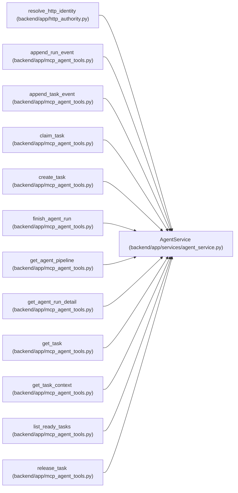

# AgentService

**Location:** `backend/app/services/agent_service.py:110`
**Kind:** Class
**Bases:** —
**Module:** [agent_service](../modules/agent_service.md)

## Description

Service for agent authentication, task control, and run tracing.

## Attributes

*No annotated attributes found.*

## Methods

| Method | Signature | Decorators | Description |
|--------|-----------|------------|-------------|
| `__init__` | `(db: AsyncSession)` | — | — |
| `authenticate` | *(async)* `(api_key: str, *, touch: bool = True) -> Optional[AgentActor]` | — | Authenticate an API key against stored enabled agent actors. |
| `authenticate_onboarding` | *(async)* `(api_key: str) -> Optional[AgentActor]` | — | Authenticate only a disabled onboarding identity for setup acknowledgement. |
| `authenticate_bootstrap_key` | `(api_key: str) -> Optional[AgentActor]` | — | Return a transient provisioning actor for the bootstrap API key. |
| `create_actor` | *(async)* `(data: AgentActorCreate, *, principal: AgentActor \| None = None) -> tuple[AgentActor, str, AgentModelBinding \| None]` | — | Create an actor and optional secret-free model binding atomically. |
| `list_ready_tasks` | *(async)* `(actor: AgentActor, iteration_id: Optional[int] = None, tags: Optional[list[str]] = None, priority_min: Optional[int] = None, priority_max: Optional[int] = None, assignee_id: Optional[int] = None, capabilities: Optional[list[str]] = None, limit: int = 50) -> list[Task]` | — | Return claimable tasks with dependencies satisfied. |
| `_active_capability_slugs` | *(async)* `() -> Optional[set[str]]` | — | Return active capability label slugs, falling back when taxonomy is absent. |
| `_parse_tags` | `(tags_value: Optional[str]) -> set[str]` | — | — |
| `claim_task` | *(async)* `(task_id: int, actor: AgentActor, data: TaskClaimRequest, idempotency_key: Optional[str] = None) -> Optional[Task]` | — | Claim a task lease for an agent. |
| `renew_claim` | *(async)* `(task_id: int, actor: AgentActor, data: TaskClaimRequest, idempotency_key: Optional[str] = None) -> Optional[Task]` | — | Renew a task lease. |
| `release_claim` | *(async)* `(task_id: int, actor: AgentActor, idempotency_key: Optional[str] = None) -> Optional[Task]` | — | Release a task lease. |
| `create_task` | *(async)* `(iteration_id: int, actor: AgentActor, data: AgentTaskCreate, idempotency_key: Optional[str] = None) -> TaskResponse` | — | Create a task on behalf of an agent, honoring idempotency. |
| `patch_task` | *(async)* `(task_id: int, actor: AgentActor, data: AgentTaskPatch, idempotency_key: Optional[str] = None) -> Optional[TaskResponse]` | — | Patch a task with optimistic concurrency and audited status handling. |
| `_command_receipt_replay` | *(async)* `(actor: AgentActor, operation: str, target_type: str, target_id: int, idempotency_key: Optional[str], request_payload: dict[str, Any]) -> Optional[dict[str, Any]]` | — | Return an exact durable command receipt or reject key reuse. |
| `_record_command_receipt` | `(actor: AgentActor, operation: str, target_type: str, target_id: int, idempotency_key: Optional[str], request_payload: dict[str, Any], response_payload: dict[str, Any]) -> None` | — | Stage one durable response snapshot in the surrounding transaction. |
| `_command_request_hash` | `(payload: dict[str, Any]) -> str` | `@staticmethod` | — |
| `_task_from_idempotency` | *(async)* `(actor: AgentActor, event_type: str, idempotency_key: Optional[str]) -> Optional[Task]` | — | Return an existing task for a prior idempotent task event. |
| `_task_event_from_idempotency` | *(async)* `(actor: AgentActor, event_type: str, idempotency_key: Optional[str], *, task_id: Optional[int] = None) -> Optional[TaskEvent]` | — | Return a prior agent task event for an idempotent operation. |
| `append_task_event` | *(async)* `(task_id: int, actor: AgentActor, data: TaskEventCreate, idempotency_key: Optional[str] = None) -> Optional[TaskEvent]` | — | Append an agent-authored task event. |
| `_task_event_matches` | `(event: TaskEvent, data: TaskEventCreate) -> bool` | — | Compare the persisted, non-secret task-event request fields. |
| `start_run` | *(async)* `(actor: AgentActor, data: AgentRunCreate, idempotency_key: Optional[str] = None) -> AgentRun` | — | Start an agent run. |
| `append_run_event` | *(async)* `(run_id: int, actor: AgentActor, data: AgentRunEventCreate) -> Optional[AgentRunEvent]` | — | Append an event to an agent run. |
| `_run_event_matches` | `(event: AgentRunEvent, run: AgentRun, data: AgentRunEventCreate) -> bool` | — | Compare a replay request with the already persisted event payload. |
| `finish_run` | *(async)* `(run_id: int, actor: AgentActor, data: AgentRunFinish) -> Optional[AgentRun]` | — | Finish an agent run and attach final trace metadata. |
| `_validate_task_fence` | `(task: Task, actor: AgentActor, claim_id: Optional[str], claim_generation: Optional[int]) -> None` | `@staticmethod` | Reject execution writes that do not own the current live fence. |
| `_validate_run_fence` | *(async)* `(run: AgentRun, actor: AgentActor, *, claim_id: Optional[str] = None, claim_generation: Optional[int] = None) -> None` | — | Validate the task fence for assignment-bound run writes. |
| `get_run` | *(async)* `(run_id: int) -> Optional[AgentRun]` | — | Get an agent run by ID. |
| `event_to_payload` | `(value: Optional[str]) -> dict[str, Any]` | — | Parse event payloads. |
| `list_to_payload` | `(value: Optional[str]) -> list[str]` | — | Parse JSON string lists. |
| `_loads` | `(value: Optional[str], fallback: Any) -> Any` | — | — |
| `get_task_timeline` | *(async)* `(task_id: int) -> list[dict[str, Any]]` | — | Return merged task event, status log, run, and run-event timeline items. |
| `_run_payload` | `(run: AgentRun) -> dict[str, Any]` | — | — |
| `get_pipeline` | *(async)* `() -> dict[str, list[TaskResponse]]` | — | Fetch and segment all tasks in the agent pipeline columns. |

## Relationships

<!-- Auto-generated relationship summary. Do not edit by hand. -->

### Summary

| Module | Methods | Attributes |
|---|---:|---|
| [agent_service](../modules/agent_service.md) | 33 | — |

### References

| Reference | Kind | Source | Call sites |
|---|---|---|---:|
| `resolve_http_identity` | call | [http_authority](../modules/http_authority.md) | 1 |
| `append_run_event` | call | [mcp_agent_tools](../modules/mcp_agent_tools.md) | 1 |
| `append_task_event` | call | [mcp_agent_tools](../modules/mcp_agent_tools.md) | 1 |
| `claim_task` | call | [mcp_agent_tools](../modules/mcp_agent_tools.md) | 1 |
| `create_task` | call | [mcp_agent_tools](../modules/mcp_agent_tools.md) | 1 |
| `finish_agent_run` | call | [mcp_agent_tools](../modules/mcp_agent_tools.md) | 1 |
| `get_agent_pipeline` | call | [mcp_agent_tools](../modules/mcp_agent_tools.md) | 1 |
| `get_agent_run_detail` | call | [mcp_agent_tools](../modules/mcp_agent_tools.md) | 1 |
| `get_task` | call | [mcp_agent_tools](../modules/mcp_agent_tools.md) | 1 |
| `get_task_context` | call | [mcp_agent_tools](../modules/mcp_agent_tools.md) | 1 |
| `list_ready_tasks` | call | [mcp_agent_tools](../modules/mcp_agent_tools.md) | 1 |
| `release_task` | call | [mcp_agent_tools](../modules/mcp_agent_tools.md) | 1 |

> References: showing 12 of 53 logical references; 41 omitted by the 12-row generated summary limit.
