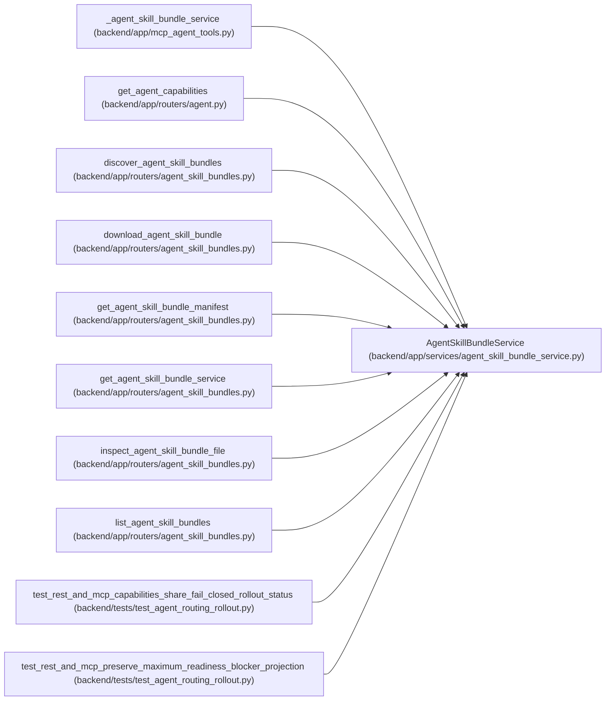

# AgentSkillBundleService

**Location:** `backend/app/services/agent_skill_bundle_service.py:114`
**Kind:** Class
**Bases:** —
**Module:** [agent_skill_bundle_service](../modules/agent_skill_bundle_service.md)

## Description

Validate and serve only files emitted by the deterministic skill build.

## Attributes

| Name | Type | Default | Description |
|------|------|---------|-------------|
| `_release_cache` | `dict[tuple[Any, ...], _CachedRelease]` | `{}` | — |
| `_cache_metrics` | `Counter[str]` | `Counter()` | — |

## Methods

| Method | Signature | Decorators | Description |
|--------|-----------|------------|-------------|
| `__init__` | `(artifact_root: Path \| None = None)` | — | — |
| `cache_metrics` | `() -> dict[str, int]` | `@classmethod` | Return process-local validation/cache counters for health exporters. |
| `clear_cache` | `() -> None` | `@classmethod` | Clear validated snapshots; intended for deterministic test isolation. |
| `_record_cache_event` | `(event: str) -> None` | `@classmethod` | — |
| `_sha256` | `(content: bytes) -> str` | `@staticmethod` | — |
| `_json_bytes` | `(value: dict[str, Any]) -> bytes` | `@staticmethod` | — |
| `_validate_artifact_name` | `(path: str) -> str` | `@staticmethod` | — |
| `_validate_skill_file_path` | `(path: str) -> str` | `@staticmethod` | — |
| `_read_artifact` | `(filename: str, *, max_bytes: int) -> bytes` | — | — |
| `_release_identity` | `() -> tuple[Any, ...]` | — | Fingerprint release metadata and bounded root entry identities. |
| `_index_unique_records` | `(records: list[Any], *, label: str) -> dict[str, Any]` | `@staticmethod` | — |
| `_validate_skill_entry` | `(skill: SkillBundleCatalogEntry) -> None` | — | — |
| `_validate_release` | `() -> _LoadedRelease` | — | — |
| `_load_release` | `() -> _LoadedRelease` | — | Return one atomically validated snapshot shared by REST and MCP callers. |
| `_find_skill` | `(release: _LoadedRelease, skill_name: str, version: str) -> SkillBundleCatalogEntry` | `@staticmethod` | — |
| `_find_archive` | `(skill: SkillBundleCatalogEntry, archive_format: Literal['zip', 'tar.gz']) -> SkillBundleArchiveRecord` | `@staticmethod` | — |
| `catalog_payload` | `() -> SkillBundlePayload` | — | Return the byte-exact mutable catalog build artifact. |
| `discovery_payload` | `(catalog_url: str) -> SkillBundlePayload` | — | Return the well-known pointer plus current catalog identity. |
| `manifest_payload` | `(skill_name: str, version: str) -> SkillBundlePayload` | — | Return a role-local manifest whose bytes cannot drift with other roles. |
| `archive_payload` | `(skill_name: str, version: str, archive_format: Literal['zip', 'tar.gz']) -> SkillBundlePayload` | — | Return one immutable archive after release-wide checksum validation. |
| `file_payload` | `(skill_name: str, version: str, requested_path: str) -> SkillBundlePayload` | — | Inspect one allow-listed file directly from the validated zip artifact. |

## Relationships

<!-- Auto-generated relationship summary. Do not edit by hand. -->

### Summary

| Module | Methods | Attributes |
|---|---:|---|
| [agent_skill_bundle_service](../modules/agent_skill_bundle_service.md) | 21 | `_cache_metrics`, `_release_cache` |

### References

| Reference | Kind | Source | Call sites |
|---|---|---|---:|
| `_agent_skill_bundle_service` | call | [mcp_agent_tools](../modules/mcp_agent_tools.md) | 1 |
| `_agent_skill_bundle_service` | type_reference | [mcp_agent_tools](../modules/mcp_agent_tools.md) | — |
| `get_agent_capabilities` | type_reference | [routers_agent](../modules/routers_agent.md) | — |
| `discover_agent_skill_bundles` | type_reference | [agent_skill_bundles](../modules/agent_skill_bundles.md) | — |
| `download_agent_skill_bundle` | type_reference | [agent_skill_bundles](../modules/agent_skill_bundles.md) | — |
| `get_agent_skill_bundle_manifest` | type_reference | [agent_skill_bundles](../modules/agent_skill_bundles.md) | — |
| `get_agent_skill_bundle_service` | call | [agent_skill_bundles](../modules/agent_skill_bundles.md) | 1 |
| `get_agent_skill_bundle_service` | type_reference | [agent_skill_bundles](../modules/agent_skill_bundles.md) | — |
| `inspect_agent_skill_bundle_file` | type_reference | [agent_skill_bundles](../modules/agent_skill_bundles.md) | — |
| `list_agent_skill_bundles` | type_reference | [agent_skill_bundles](../modules/agent_skill_bundles.md) | — |
| `test_rest_and_mcp_capabilities_share_fail_closed_rollout_status` | call | [test_agent_routing_rollout](../modules/test_agent_routing_rollout.md) | 1 |
| `test_rest_and_mcp_preserve_maximum_readiness_blocker_projection` | call | [test_agent_routing_rollout](../modules/test_agent_routing_rollout.md) | 1 |
