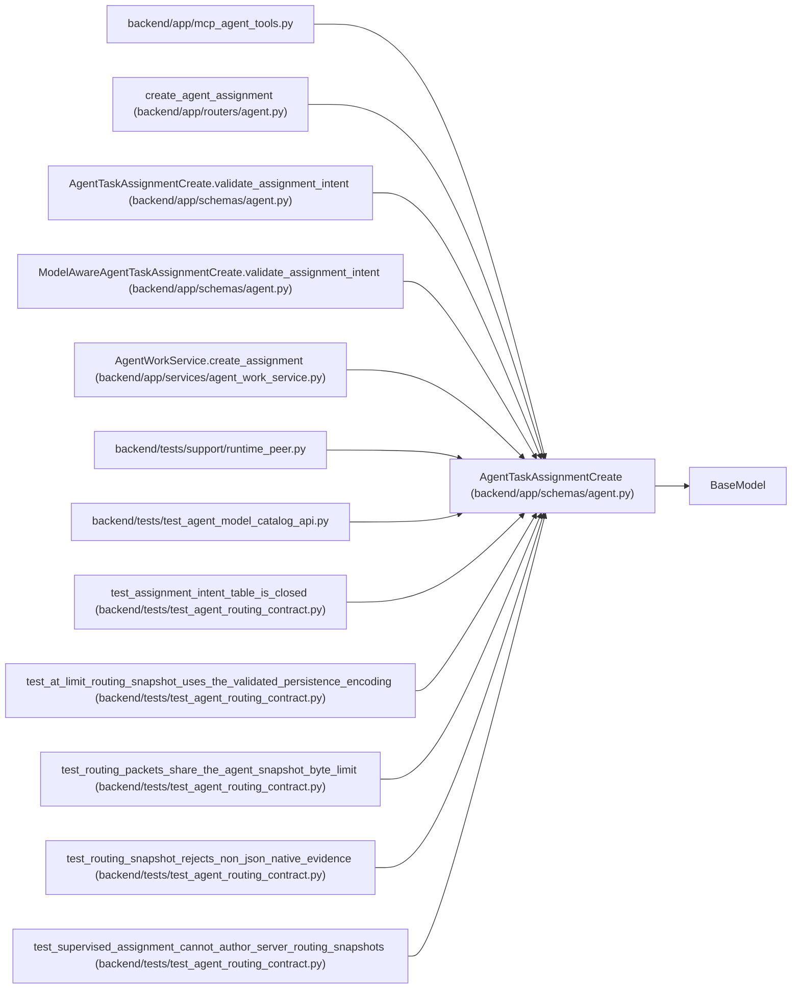

# AgentTaskAssignmentCreate

**Location:** `backend/app/schemas/agent.py:486`
**Kind:** Pydantic model
**Bases:** `BaseModel`
**Module:** [schemas_agent](../modules/schemas_agent.md)

## Description

PM command to dispatch a task to an exact actor.

## Model Configuration

| Setting | Value | Source |
|---------|-------|--------|
| `extra` | `'forbid'` | model_config |

## Validators

| Method | Scope | Fields | Mode | Options |
|--------|-------|--------|------|---------|
| `validate_routing_snapshot_size` | field | routing_snapshot | after | — |
| `validate_assignment_intent` | model | — | after | — |

## Attributes

| Name | Type | Wire name | Required | Nullable | Default | Constraints | Examples | Description |
|------|------|-----------|----------|----------|---------|-------------|-------------|----------|
| `task_id` | `int` | `task_id` | Yes | No | — | — | — | — |
| `actor_id` | `int` | `actor_id` | Yes | No | — | — | — | — |
| `team_member_id` | `Optional[int]` | `team_member_id` | No | Yes | `None` | — | — | — |
| `purpose` | `AgentAssignmentPurpose` | `purpose` | No | No | `'execution'` | — | — | — |
| `queue_class` | `AgentAssignmentQueueClass` | `queue_class` | No | No | `'normal'` | — | — | — |
| `queue_rank` | `int` | `queue_rank` | No | No | `1000` | ge=0 | — | — |
| `not_before` | `Optional[datetime]` | `not_before` | No | Yes | `None` | — | — | — |
| `reviewer_profile_id` | `Optional[int]` | `reviewer_profile_id` | No | Yes | `None` | — | — | — |
| `routing_snapshot` | `dict[str, Any]` | `routing_snapshot` | No | No | factory: `dict` | max_length=unknown (MAX_AGENT_JSON_FIELDS) | — | — |
| `reason` | `Optional[str]` | `reason` | No | Yes | `None` | max_length=unknown (MAX_AGENT_TEXT_LENGTH) | — | — |
| `expected_task_version` | `int` | `expected_task_version` | Yes | No | — | ge=1 | — | — |

## Methods

| Method | Signature | Decorators | Description |
|--------|-----------|------------|-------------|
| `validate_routing_snapshot_size` | `(value: dict[str, Any]) -> dict[str, Any]` | `@field_validator('routing_snapshot')`, `@classmethod` | Keep assignment routing evidence bounded in durable queue responses. |
| `validate_assignment_intent` | `() -> 'AgentTaskAssignmentCreate'` | `@model_validator(mode='after')` | Freeze the four supported purpose/queue-class combinations. |

## Relationships

<!-- Auto-generated relationship summary. Do not edit by hand. -->

### Summary

| Module | Methods | Attributes |
|---|---:|---|
| [schemas_agent](../modules/schemas_agent.md) | 2 | `actor_id`, `expected_task_version`, `not_before`, `purpose`, `queue_class`, `queue_rank`, `reason`, `reviewer_profile_id`, `routing_snapshot`, `task_id`, `team_member_id` |

### Structure

| Kind | Entity | Module |
|---|---|---|
| Base | `BaseModel` | — |

### References

| Reference | Kind | Source | Call sites |
|---|---|---|---:|
| `mcp_agent_tools` | import | [mcp_agent_tools](../modules/mcp_agent_tools.md) | — |
| `create_agent_assignment` | type_reference | [routers_agent](../modules/routers_agent.md) | — |
| `AgentTaskAssignmentCreate.validate_assignment_intent` | type_reference | [schemas_agent](../modules/schemas_agent.md) | — |
| `ModelAwareAgentTaskAssignmentCreate.validate_assignment_intent` | type_reference | [schemas_agent](../modules/schemas_agent.md) | — |
| `AgentWorkService.create_assignment` | type_reference | [agent_work_service](../modules/agent_work_service.md) | — |
| `runtime_peer` | import | [runtime_peer](../modules/runtime_peer.md) | — |
| `test_agent_model_catalog_api` | import | [test_agent_model_catalog_api](../modules/test_agent_model_catalog_api.md) | — |
| `test_assignment_intent_table_is_closed` | call | [test_agent_routing_contract](../modules/test_agent_routing_contract.md) | 1 |
| `test_at_limit_routing_snapshot_uses_the_validated_persistence_encoding` | call | [test_agent_routing_contract](../modules/test_agent_routing_contract.md) | 1 |
| `test_routing_packets_share_the_agent_snapshot_byte_limit` | call | [test_agent_routing_contract](../modules/test_agent_routing_contract.md) | 1 |
| `test_routing_snapshot_rejects_non_json_native_evidence` | call | [test_agent_routing_contract](../modules/test_agent_routing_contract.md) | 1 |
| `test_supervised_assignment_cannot_author_server_routing_snapshots` | call | [test_agent_routing_contract](../modules/test_agent_routing_contract.md) | 1 |

> References: showing 12 of 16 logical references; 4 omitted by the 12-row generated summary limit.
