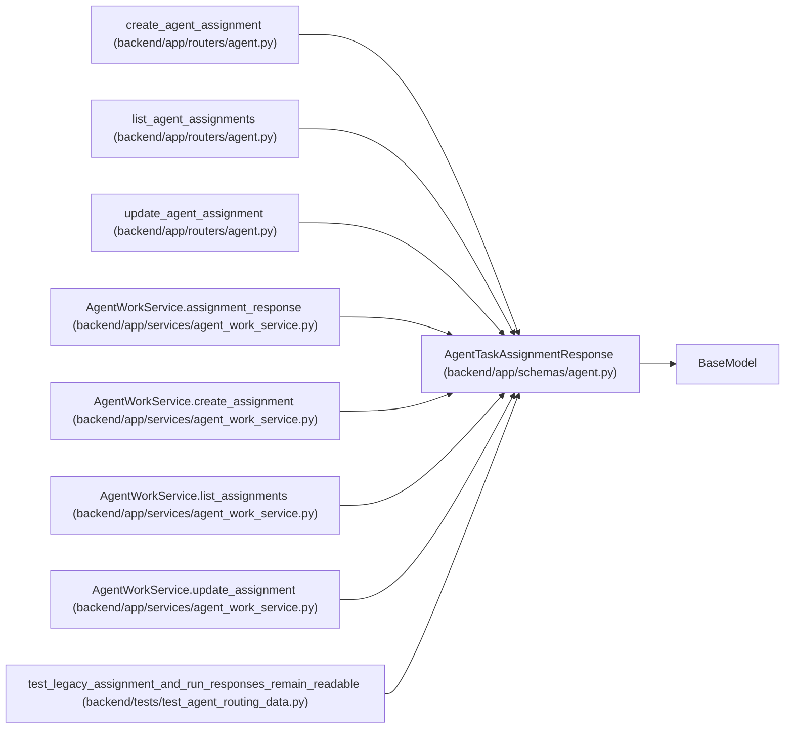

# AgentTaskAssignmentResponse

**Location:** `backend/app/schemas/agent.py:640`
**Kind:** Pydantic model
**Bases:** `BaseModel`
**Module:** [schemas_agent](../modules/schemas_agent.md)

## Description

Durable agent task assignment response.

## Attributes

| Name | Type | Wire name | Required | Nullable | Default | Constraints | Examples | Description |
|------|------|-----------|----------|----------|---------|-------------|-------------|----------|
| `id` | `int` | `id` | Yes | No | — | — | — | — |
| `task_id` | `int` | `task_id` | Yes | No | — | — | — | — |
| `actor_id` | `int` | `actor_id` | Yes | No | — | — | — | — |
| `team_member_id` | `Optional[int]` | `team_member_id` | No | Yes | `None` | — | — | — |
| `purpose` | `str` | `purpose` | Yes | No | — | — | — | — |
| `queue_class` | `str` | `queue_class` | Yes | No | — | — | — | — |
| `state` | `str` | `state` | Yes | No | — | — | — | — |
| `queue_rank` | `int` | `queue_rank` | Yes | No | — | — | — | — |
| `not_before` | `Optional[datetime]` | `not_before` | No | Yes | `None` | — | — | — |
| `assigned_by_actor_id` | `Optional[int]` | `assigned_by_actor_id` | No | Yes | `None` | — | — | — |
| `reviewer_profile_id` | `Optional[int]` | `reviewer_profile_id` | No | Yes | `None` | — | — | — |
| `task_version` | `int` | `task_version` | Yes | No | — | — | — | — |
| `model_binding_id` | `Optional[int]` | `model_binding_id` | No | Yes | `None` | — | — | — |
| `model_binding_revision` | `Optional[int]` | `model_binding_revision` | No | Yes | `None` | — | — | — |
| `model_binding_status` | `Literal['not_selected', 'current', 'stale', 'unresolved']` | `model_binding_status` | No | No | `'not_selected'` | — | — | — |
| `model_binding_stale_reasons` | `list[str]` | `model_binding_stale_reasons` | No | No | factory: `list` | — | — | — |
| `routing_snapshot` | `dict[str, Any]` | `routing_snapshot` | No | No | factory: `dict` | — | — | — |
| `reason` | `Optional[str]` | `reason` | No | Yes | `None` | — | — | — |
| `created_at` | `datetime` | `created_at` | Yes | No | — | — | — | — |
| `updated_at` | `datetime` | `updated_at` | Yes | No | — | — | — | — |

## Methods

*No public methods. Inherits from base classes.*

## Relationships

<!-- Auto-generated relationship summary. Do not edit by hand. -->

### Summary

| Module | Methods | Attributes |
|---|---:|---|
| [schemas_agent](../modules/schemas_agent.md) | 0 | `actor_id`, `assigned_by_actor_id`, `created_at`, `id`, `model_binding_id`, `model_binding_revision`, `model_binding_stale_reasons`, `model_binding_status`, `not_before`, `purpose`, `queue_class`, `queue_rank` |

### Structure

| Kind | Entity | Module |
|---|---|---|
| Base | `BaseModel` | — |

### References

| Reference | Kind | Source | Call sites |
|---|---|---|---:|
| `create_agent_assignment` | type_reference | [routers_agent](../modules/routers_agent.md) | — |
| `list_agent_assignments` | type_reference | [routers_agent](../modules/routers_agent.md) | — |
| `update_agent_assignment` | type_reference | [routers_agent](../modules/routers_agent.md) | — |
| `AgentWorkService.assignment_response` | call | [agent_work_service](../modules/agent_work_service.md) | 1 |
| `AgentWorkService.assignment_response` | type_reference | [agent_work_service](../modules/agent_work_service.md) | — |
| `AgentWorkService.create_assignment` | type_reference | [agent_work_service](../modules/agent_work_service.md) | — |
| `AgentWorkService.list_assignments` | type_reference | [agent_work_service](../modules/agent_work_service.md) | — |
| `AgentWorkService.update_assignment` | type_reference | [agent_work_service](../modules/agent_work_service.md) | — |
| `test_legacy_assignment_and_run_responses_remain_readable` | call | [test_agent_routing_data](../modules/test_agent_routing_data.md) | 1 |
