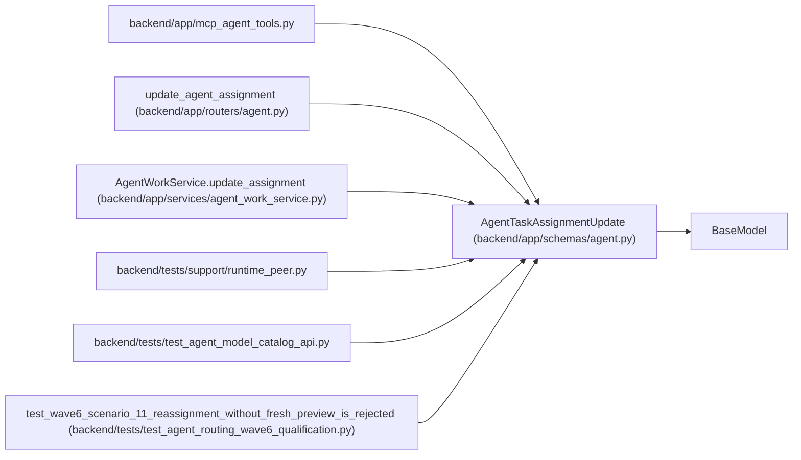

# AgentTaskAssignmentUpdate

**Location:** `backend/app/schemas/agent.py:591`
**Kind:** Pydantic model
**Bases:** `BaseModel`
**Module:** [schemas_agent](../modules/schemas_agent.md)

## Description

PM command to reorder, reassign, or cancel a queued assignment.

## Model Configuration

| Setting | Value | Source |
|---------|-------|--------|
| `extra` | `'forbid'` | model_config |

## Attributes

| Name | Type | Wire name | Required | Nullable | Default | Constraints | Examples | Description |
|------|------|-----------|----------|----------|---------|-------------|-------------|----------|
| `actor_id` | `Optional[int]` | `actor_id` | No | Yes | `None` | — | — | — |
| `queue_rank` | `Optional[int]` | `queue_rank` | No | Yes | `None` | ge=0 | — | — |
| `not_before` | `Optional[datetime]` | `not_before` | No | Yes | `None` | — | — | — |
| `reviewer_profile_id` | `Optional[int]` | `reviewer_profile_id` | No | Yes | `None` | — | — | — |
| `state` | `Optional[Literal['queued', 'cancelled']]` | `state` | No | Yes | `None` | — | — | — |
| `reason` | `Optional[str]` | `reason` | No | Yes | `None` | max_length=unknown (MAX_AGENT_TEXT_LENGTH) | — | — |
| `expected_queue_revision` | `int` | `expected_queue_revision` | Yes | No | — | ge=1 | — | — |

## Methods

*No public methods. Inherits from base classes.*

## Relationships

<!-- Auto-generated relationship summary. Do not edit by hand. -->

### Summary

| Module | Methods | Attributes |
|---|---:|---|
| [schemas_agent](../modules/schemas_agent.md) | 0 | `actor_id`, `expected_queue_revision`, `not_before`, `queue_rank`, `reason`, `reviewer_profile_id`, `state` |

### Structure

| Kind | Entity | Module |
|---|---|---|
| Base | `BaseModel` | — |

### References

| Reference | Kind | Source | Call sites |
|---|---|---|---:|
| `mcp_agent_tools` | import | [mcp_agent_tools](../modules/mcp_agent_tools.md) | — |
| `update_agent_assignment` | type_reference | [routers_agent](../modules/routers_agent.md) | — |
| `AgentWorkService.update_assignment` | type_reference | [agent_work_service](../modules/agent_work_service.md) | — |
| `runtime_peer` | import | [runtime_peer](../modules/runtime_peer.md) | — |
| `test_agent_model_catalog_api` | import | [test_agent_model_catalog_api](../modules/test_agent_model_catalog_api.md) | — |
| `test_wave6_scenario_11_reassignment_without_fresh_preview_is_rejected` | call | [test_agent_routing_wave6_qualification](../modules/test_agent_routing_wave6_qualification.md) | 1 |
