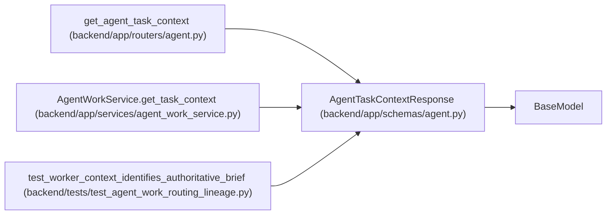

# AgentTaskContextResponse

**Location:** `backend/app/schemas/agent.py:760`
**Kind:** Pydantic model
**Bases:** `BaseModel`
**Module:** [schemas_agent](../modules/schemas_agent.md)

## Description

The serialized `brief_source` is derived from the canonical brief presence. Consumers use typed criteria and revisions when canonical, and use `task_brief` only when no canonical brief exists.

Complete task context for an assigned worker.

## Attributes

| Name | Type | Wire name | Required | Nullable | Default | Constraints | Examples | Description |
|------|------|-----------|----------|----------|---------|-------------|-------------|----------|
| `task` | `TaskResponse` | `task` | Yes | No | — | — | — | — |
| `assignment` | `Optional[AgentTaskAssignmentResponse]` | `assignment` | No | Yes | `None` | — | — | — |
| `task_brief` | `dict[str, str]` | `task_brief` | No | No | factory: `dict` | — | — | Legacy Markdown projection. When task.brief exists, its typed fields and criterion identities are authoritative. |
| `parent_chain` | `list[dict[str, Any]]` | `parent_chain` | No | No | factory: `list` | — | — | — |
| `dependencies` | `list[AgentDependencyContext]` | `dependencies` | No | No | factory: `list` | — | — | — |
| `request_sources` | `list[RequestSourceLinkWithSourceResponse]` | `request_sources` | No | No | factory: `list` | — | — | — |
| `timeline` | `list[TaskTimelineItem]` | `timeline` | No | No | factory: `list` | — | — | — |
| `definition_ready` | `bool` | `definition_ready` | No | No | `False` | — | — | — |
| `start_ready` | `bool` | `start_ready` | No | No | `False` | — | — | — |
| `blocker_codes` | `list[str]` | `blocker_codes` | No | No | factory: `list` | — | — | — |

## Methods

| Method | Signature | Decorators | Description |
|--------|-----------|------------|-------------|
| `brief_source` | `() -> Literal['canonical', 'legacy_markdown']` | `@computed_field`, `@property` | Identify the authoritative brief without duplicating mutable content. |

## Relationships

<!-- Auto-generated relationship summary. Do not edit by hand. -->

### Summary

| Module | Methods | Attributes |
|---|---:|---|
| [schemas_agent](../modules/schemas_agent.md) | 1 | `assignment`, `blocker_codes`, `definition_ready`, `dependencies`, `parent_chain`, `request_sources`, `start_ready`, `task`, `task_brief`, `timeline` |

### Structure

| Kind | Entity | Module |
|---|---|---|
| Base | `BaseModel` | — |

### References

| Reference | Kind | Source | Call sites |
|---|---|---|---:|
| `get_agent_task_context` | type_reference | [routers_agent](../modules/routers_agent.md) | — |
| `AgentWorkService.get_task_context` | call | [agent_work_service](../modules/agent_work_service.md) | 1 |
| `AgentWorkService.get_task_context` | type_reference | [agent_work_service](../modules/agent_work_service.md) | — |
| `test_worker_context_identifies_authoritative_brief` | call | [test_agent_work_routing_lineage](../modules/test_agent_work_routing_lineage.md) | 1 |
