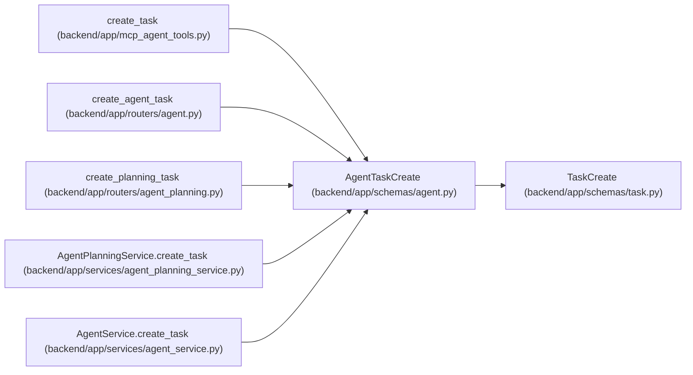

# AgentTaskCreate

**Location:** `backend/app/schemas/agent.py:235`
**Kind:** Pydantic model
**Bases:** `TaskCreate`
**Module:** [schemas_agent](../modules/schemas_agent.md)

## Description

Agent task creation request.

## Attributes

*No annotated attributes found.*

## Methods

*No public methods. Inherits from base classes.*

## Relationships

<!-- Auto-generated relationship summary. Do not edit by hand. -->

### Summary

| Module | Methods | Attributes |
|---|---:|---|
| [schemas_agent](../modules/schemas_agent.md) | 0 | — |

### Structure

| Kind | Entity | Module |
|---|---|---|
| Base | `TaskCreate` | [schemas_task](../modules/schemas_task.md) |

### References

| Reference | Kind | Source | Call sites |
|---|---|---|---:|
| `create_task` | call | [mcp_agent_tools](../modules/mcp_agent_tools.md) | 1 |
| `create_agent_task` | type_reference | [routers_agent](../modules/routers_agent.md) | — |
| `create_planning_task` | type_reference | [routers_agent_planning](../modules/routers_agent_planning.md) | — |
| `AgentPlanningService.create_task` | type_reference | [agent_planning_service](../modules/agent_planning_service.md) | — |
| `AgentService.create_task` | type_reference | [agent_service](../modules/agent_service.md) | — |
