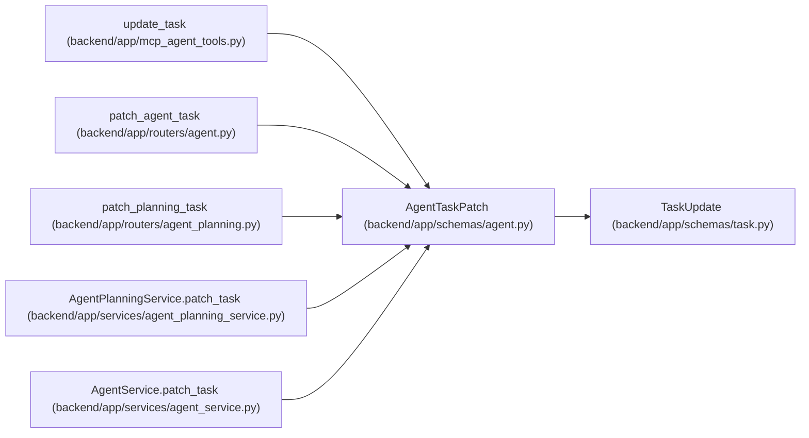

# AgentTaskPatch

**Location:** `backend/app/schemas/agent.py:240`
**Kind:** Pydantic model
**Bases:** `TaskUpdate`
**Module:** [schemas_agent](../modules/schemas_agent.md)

## Description

Agent task patch request with optimistic concurrency.

## Attributes

| Name | Type | Wire name | Required | Nullable | Default | Constraints | Examples | Description |
|------|------|-----------|----------|----------|---------|-------------|-------------|----------|
| `expected_version` | `int` | `expected_version` | Yes | No | — | ge=1 | — | — |
| `claim_id` | `Optional[str]` | `claim_id` | No | Yes | `None` | max_length=64; min_length=16 | — | — |
| `claim_generation` | `Optional[int]` | `claim_generation` | No | Yes | `None` | ge=1 | — | — |

## Methods

*No public methods. Inherits from base classes.*

## Relationships

<!-- Auto-generated relationship summary. Do not edit by hand. -->

### Summary

| Module | Methods | Attributes |
|---|---:|---|
| [schemas_agent](../modules/schemas_agent.md) | 0 | `claim_generation`, `claim_id`, `expected_version` |

### Structure

| Kind | Entity | Module |
|---|---|---|
| Base | `TaskUpdate` | [schemas_task](../modules/schemas_task.md) |

### References

| Reference | Kind | Source | Call sites |
|---|---|---|---:|
| `update_task` | call | [mcp_agent_tools](../modules/mcp_agent_tools.md) | 1 |
| `patch_agent_task` | type_reference | [routers_agent](../modules/routers_agent.md) | — |
| `patch_planning_task` | type_reference | [routers_agent_planning](../modules/routers_agent_planning.md) | — |
| `AgentPlanningService.patch_task` | type_reference | [agent_planning_service](../modules/agent_planning_service.md) | — |
| `AgentService.patch_task` | type_reference | [agent_service](../modules/agent_service.md) | — |
