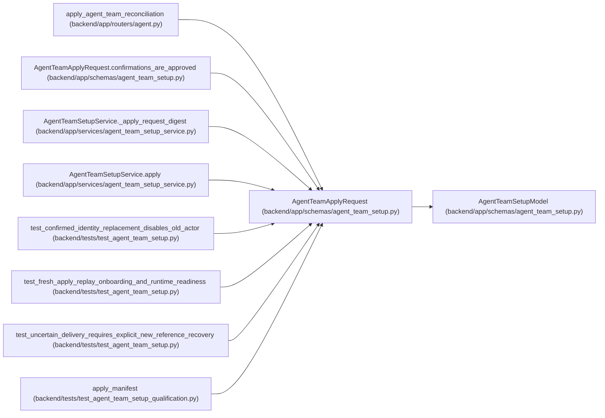

# AgentTeamApplyRequest

**Location:** `backend/app/schemas/agent_team_setup.py:733`
**Kind:** Pydantic model
**Bases:** `AgentTeamSetupModel`
**Module:** [agent_team_setup](../modules/agent_team_setup.md)

## Description

_Auto-generated from `AgentTeamApplyRequest` in `backend/app/schemas/agent_team_setup.py`._

## Validators

| Method | Scope | Fields | Mode | Options |
|--------|-------|--------|------|---------|
| `normalize_action_ids` | field | approved_action_ids, confirmed_action_ids | after | — |
| `confirmations_are_approved` | model | — | after | — |

## Attributes

| Name | Type | Wire name | Required | Nullable | Default | Constraints | Examples | Description |
|------|------|-----------|----------|----------|---------|-------------|-------------|----------|
| `manifest` | `AgentTeamMaster` | `manifest` | Yes | No | — | — | — | — |
| `expected_topology_revision` | `int` | `expected_topology_revision` | Yes | No | — | ge=0 | — | — |
| `plan_digest` | `str` | `plan_digest` | Yes | No | — | pattern=unknown (SHA256_PATTERN) | — | — |
| `approved_action_ids` | `tuple[str, ...]` | `approved_action_ids` | Yes | No | — | min_length=1; max_length=unknown (MAX_AGENT_TEAM_ACTIONS) | — | — |
| `confirmed_action_ids` | `tuple[str, ...]` | `confirmed_action_ids` | No | No | `()` | max_length=unknown (MAX_AGENT_TEAM_ACTIONS) | — | — |

## Methods

| Method | Signature | Decorators | Description |
|--------|-----------|------------|-------------|
| `normalize_action_ids` | `(value: tuple[str, ...], info: Any) -> tuple[str, ...]` | `@field_validator('approved_action_ids', 'confirmed_action_ids')`, `@classmethod` | — |
| `confirmations_are_approved` | `() -> 'AgentTeamApplyRequest'` | `@model_validator(mode='after')` | — |

## Relationships

<!-- Auto-generated relationship summary. Do not edit by hand. -->

### Summary

| Module | Methods | Attributes |
|---|---:|---|
| [agent_team_setup](../modules/agent_team_setup.md) | 2 | `approved_action_ids`, `confirmed_action_ids`, `expected_topology_revision`, `manifest`, `plan_digest` |

### Structure

| Kind | Entity | Module |
|---|---|---|
| Base | `AgentTeamSetupModel` | [agent_team_setup](../modules/agent_team_setup.md) |

### References

| Reference | Kind | Source | Call sites |
|---|---|---|---:|
| `apply_agent_team_reconciliation` | type_reference | [routers_agent](../modules/routers_agent.md) | — |
| `AgentTeamApplyRequest.confirmations_are_approved` | type_reference | [agent_team_setup](../modules/agent_team_setup.md) | — |
| `AgentTeamSetupService._apply_request_digest` | type_reference | [agent_team_setup_service](../modules/agent_team_setup_service.md) | — |
| `AgentTeamSetupService.apply` | type_reference | [agent_team_setup_service](../modules/agent_team_setup_service.md) | — |
| `test_confirmed_identity_replacement_disables_old_actor` | call | [test_agent_team_setup](../modules/test_agent_team_setup.md) | 2 |
| `test_fresh_apply_replay_onboarding_and_runtime_readiness` | call | [test_agent_team_setup](../modules/test_agent_team_setup.md) | 1 |
| `test_uncertain_delivery_requires_explicit_new_reference_recovery` | call | [test_agent_team_setup](../modules/test_agent_team_setup.md) | 2 |
| `apply_manifest` | call | [test_agent_team_setup_qualification](../modules/test_agent_team_setup_qualification.md) | 1 |
