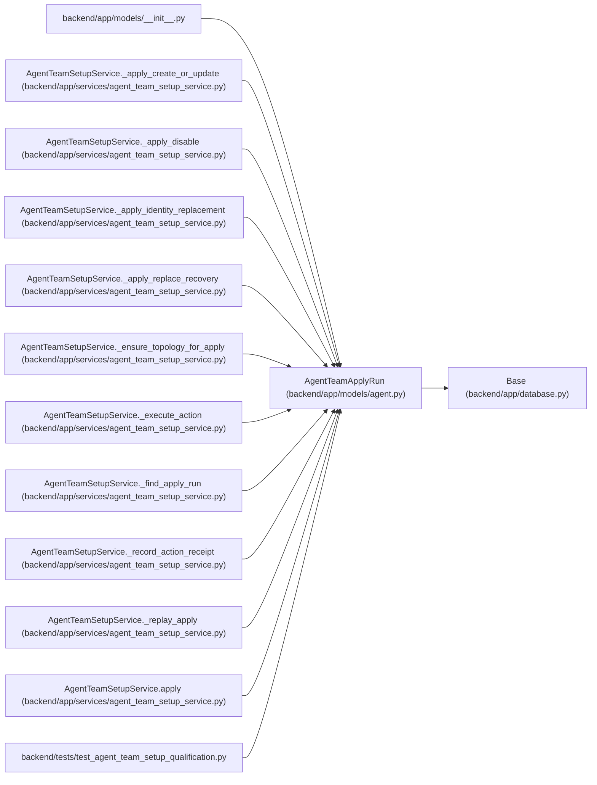

# AgentTeamApplyRun

**Location:** `backend/app/models/agent.py:555`
**Kind:** Class
**Bases:** `Base`
**Module:** [models_agent](../modules/models_agent.md)

## Description

Replay-safe setup command receipt with a resumable action plan.

## Attributes

| Name | Type | Default | Description |
|------|------|---------|-------------|
| `id` | `Mapped[int]` | `mapped_column(Integer, primary_key=True, autoincrement=True)` | — |
| `apply_id` | `Mapped[str]` | `mapped_column(String(32), unique=True, nullable=False)` | — |
| `topology_id` | `Mapped[Optional[int]]` | `mapped_column(Integer, ForeignKey('agent_team_topologies.id', ondelete='SET NULL'), nullable=True)` | — |
| `topology_key` | `Mapped[str]` | `mapped_column(String(100), nullable=False)` | — |
| `principal_key` | `Mapped[str]` | `mapped_column(String(160), nullable=False)` | — |
| `principal_actor_id` | `Mapped[Optional[int]]` | `mapped_column(Integer, ForeignKey('agent_actors.id', ondelete='SET NULL'), nullable=True)` | — |
| `idempotency_key` | `Mapped[str]` | `mapped_column(String(255), nullable=False)` | — |
| `request_digest` | `Mapped[str]` | `mapped_column(String(64), nullable=False)` | — |
| `manifest_digest` | `Mapped[str]` | `mapped_column(String(64), nullable=False)` | — |
| `plan_digest` | `Mapped[str]` | `mapped_column(String(64), nullable=False)` | — |
| `expected_topology_revision` | `Mapped[int]` | `mapped_column(Integer, nullable=False)` | — |
| `resulting_topology_revision` | `Mapped[int]` | `mapped_column(Integer, default=0, nullable=False)` | — |
| `approved_action_ids` | `Mapped[str]` | `mapped_column(Text, nullable=False)` | — |
| `confirmed_action_ids` | `Mapped[str]` | `mapped_column(Text, nullable=False)` | — |
| `plan_payload` | `Mapped[str]` | `mapped_column(Text, nullable=False)` | — |
| `rationale` | `Mapped[str]` | `mapped_column(String(2000), nullable=False)` | — |
| `correlation_id` | `Mapped[str]` | `mapped_column(String(255), nullable=False)` | — |
| `status` | `Mapped[str]` | `mapped_column(String(30), default='running', nullable=False)` | — |
| `blocker_codes` | `Mapped[str]` | `mapped_column(Text, default='[]', nullable=False)` | — |
| `response_payload` | `Mapped[Optional[str]]` | `mapped_column(Text, nullable=True)` | — |
| `created_at` | `Mapped[datetime]` | `mapped_column(UTCDateTime(), default=utc_now, nullable=False)` | — |
| `updated_at` | `Mapped[datetime]` | `mapped_column(UTCDateTime(), default=utc_now, onupdate=utc_now, nullable=False)` | — |
| `topology` | `Mapped[Optional['AgentTeamTopology']]` | `relationship('AgentTeamTopology', back_populates='apply_runs')` | — |
| `principal_actor` | `Mapped[Optional['AgentActor']]` | `relationship('AgentActor', foreign_keys=[principal_actor_id])` | — |
| `action_receipts` | `Mapped[list['AgentTeamActionReceipt']]` | `relationship('AgentTeamActionReceipt', back_populates='apply_run', passive_deletes=True, order_by='AgentTeamActionReceipt.id')` | — |

## Methods

*No public methods. Inherits from base classes.*

## Relationships

<!-- Auto-generated relationship summary. Do not edit by hand. -->

### Summary

| Module | Methods | Attributes |
|---|---:|---|
| [models_agent](../modules/models_agent.md) | 0 | `action_receipts`, `apply_id`, `approved_action_ids`, `blocker_codes`, `confirmed_action_ids`, `correlation_id`, `created_at`, `expected_topology_revision`, `id`, `idempotency_key`, `manifest_digest`, `plan_digest` |

### Structure

| Kind | Entity | Module |
|---|---|---|
| Base | `Base` | [app_database](../modules/app_database.md) |

### References

| Reference | Kind | Source | Call sites |
|---|---|---|---:|
| `__init__` | import | [models___init__](../modules/models___init__.md) | — |
| `AgentTeamSetupService._apply_create_or_update` | type_reference | [agent_team_setup_service](../modules/agent_team_setup_service.md) | — |
| `AgentTeamSetupService._apply_disable` | type_reference | [agent_team_setup_service](../modules/agent_team_setup_service.md) | — |
| `AgentTeamSetupService._apply_identity_replacement` | type_reference | [agent_team_setup_service](../modules/agent_team_setup_service.md) | — |
| `AgentTeamSetupService._apply_replace_recovery` | type_reference | [agent_team_setup_service](../modules/agent_team_setup_service.md) | — |
| `AgentTeamSetupService._ensure_topology_for_apply` | type_reference | [agent_team_setup_service](../modules/agent_team_setup_service.md) | — |
| `AgentTeamSetupService._execute_action` | type_reference | [agent_team_setup_service](../modules/agent_team_setup_service.md) | — |
| `AgentTeamSetupService._find_apply_run` | type_reference | [agent_team_setup_service](../modules/agent_team_setup_service.md) | — |
| `AgentTeamSetupService._record_action_receipt` | type_reference | [agent_team_setup_service](../modules/agent_team_setup_service.md) | — |
| `AgentTeamSetupService._replay_apply` | type_reference | [agent_team_setup_service](../modules/agent_team_setup_service.md) | — |
| `AgentTeamSetupService.apply` | call | [agent_team_setup_service](../modules/agent_team_setup_service.md) | 1 |
| `test_agent_team_setup_qualification` | import | [test_agent_team_setup_qualification](../modules/test_agent_team_setup_qualification.md) | — |
