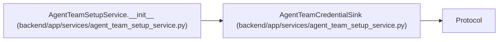

# AgentTeamCredentialSink

**Location:** `backend/app/services/agent_team_setup_service.py:115`
**Kind:** Class
**Bases:** `Protocol`
**Module:** [agent_team_setup_service](../modules/agent_team_setup_service.md)

## Description

One-way sink boundary; implementations never return credential material.

## Attributes

| Name | Type | Default | Description |
|------|------|---------|-------------|
| `reference` | `str` | *required* | — |

## Methods

| Method | Signature | Decorators | Description |
|--------|-----------|------------|-------------|
| `available` | `() -> bool` | `@property` | — |
| `deliver` | *(async)* `(*, credential_ref: str, actor_key: str, actor_name: str, api_key: str) -> str` | — | Deliver once and return a non-secret receipt digest. |

## Relationships

<!-- Auto-generated relationship summary. Do not edit by hand. -->

### Summary

| Module | Methods | Attributes |
|---|---:|---|
| [agent_team_setup_service](../modules/agent_team_setup_service.md) | 2 | `reference` |

### Structure

| Kind | Entity | Module |
|---|---|---|
| Base | `Protocol` | — |

### References

| Reference | Kind | Source | Call sites |
|---|---|---|---:|
| `AgentTeamSetupService.__init__` | type_reference | [agent_team_setup_service](../modules/agent_team_setup_service.md) | — |
