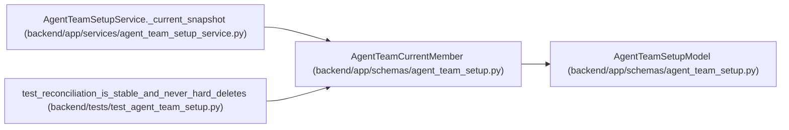

# AgentTeamCurrentMember

**Location:** `backend/app/schemas/agent_team_setup.py:420`
**Kind:** Pydantic model
**Bases:** `AgentTeamSetupModel`
**Module:** [agent_team_setup](../modules/agent_team_setup.md)

## Description

Redacted authoritative member projection used by reconciliation.

## Attributes

| Name | Type | Wire name | Required | Nullable | Default | Constraints | Examples | Description |
|------|------|-----------|----------|----------|---------|-------------|-------------|----------|
| `actor_key` | `str` | `actor_key` | Yes | No | — | pattern=unknown (STABLE_KEY_PATTERN) | — | — |
| `actor_id` | `int \| None` | `actor_id` | No | Yes | `None` | ge=1 | — | — |
| `actor_name` | `str` | `actor_name` | Yes | No | — | pattern=unknown (STABLE_KEY_PATTERN) | — | — |
| `topology_key` | `str \| None` | `topology_key` | No | Yes | `None` | pattern=unknown (STABLE_KEY_PATTERN) | — | — |
| `object_revision` | `int` | `object_revision` | Yes | No | — | ge=1 | — | — |
| `lifecycle_state` | `AgentTeamMemberLifecycle` | `lifecycle_state` | Yes | No | — | — | — | — |
| `desired_spec` | `AgentTeamMemberSpec` | `desired_spec` | Yes | No | — | — | — | — |

## Methods

*No public methods. Inherits from base classes.*

## Relationships

<!-- Auto-generated relationship summary. Do not edit by hand. -->

### Summary

| Module | Methods | Attributes |
|---|---:|---|
| [agent_team_setup](../modules/agent_team_setup.md) | 0 | `actor_id`, `actor_key`, `actor_name`, `desired_spec`, `lifecycle_state`, `object_revision`, `topology_key` |

### Structure

| Kind | Entity | Module |
|---|---|---|
| Base | `AgentTeamSetupModel` | [agent_team_setup](../modules/agent_team_setup.md) |

### References

| Reference | Kind | Source | Call sites |
|---|---|---|---:|
| `AgentTeamSetupService._current_snapshot` | call | [agent_team_setup_service](../modules/agent_team_setup_service.md) | 1 |
| `test_reconciliation_is_stable_and_never_hard_deletes` | call | [test_agent_team_setup](../modules/test_agent_team_setup.md) | 2 |
