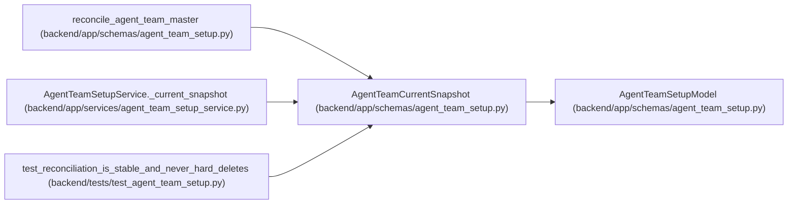

# AgentTeamCurrentSnapshot

**Location:** `backend/app/schemas/agent_team_setup.py:432`
**Kind:** Pydantic model
**Bases:** `AgentTeamSetupModel`
**Module:** [agent_team_setup](../modules/agent_team_setup.md)

## Description

Current topology state with installation-local IDs kept separate.

## Attributes

| Name | Type | Wire name | Required | Nullable | Default | Constraints | Examples | Description |
|------|------|-----------|----------|----------|---------|-------------|-------------|----------|
| `topology_key` | `str` | `topology_key` | Yes | No | — | pattern=unknown (STABLE_KEY_PATTERN) | — | — |
| `revision` | `int` | `revision` | Yes | No | — | ge=0 | — | — |
| `manifest_digest` | `str \| None` | `manifest_digest` | No | Yes | `None` | pattern=unknown (SHA256_PATTERN) | — | — |
| `members` | `tuple[AgentTeamCurrentMember, ...]` | `members` | No | No | `()` | max_length=unknown (MAX_AGENT_TEAM_MEMBERS * 2) | — | — |

## Methods

*No public methods. Inherits from base classes.*

## Relationships

<!-- Auto-generated relationship summary. Do not edit by hand. -->

### Summary

| Module | Methods | Attributes |
|---|---:|---|
| [agent_team_setup](../modules/agent_team_setup.md) | 0 | `manifest_digest`, `members`, `revision`, `topology_key` |

### Structure

| Kind | Entity | Module |
|---|---|---|
| Base | `AgentTeamSetupModel` | [agent_team_setup](../modules/agent_team_setup.md) |

### References

| Reference | Kind | Source | Call sites |
|---|---|---|---:|
| `reconcile_agent_team_master` | type_reference | [agent_team_setup](../modules/agent_team_setup.md) | — |
| `AgentTeamSetupService._current_snapshot` | call | [agent_team_setup_service](../modules/agent_team_setup_service.md) | 2 |
| `AgentTeamSetupService._current_snapshot` | type_reference | [agent_team_setup_service](../modules/agent_team_setup_service.md) | — |
| `test_reconciliation_is_stable_and_never_hard_deletes` | call | [test_agent_team_setup](../modules/test_agent_team_setup.md) | 2 |
