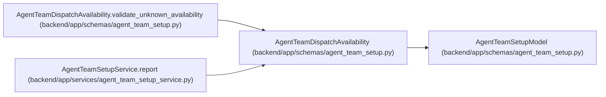

# AgentTeamDispatchAvailability

**Location:** `backend/app/schemas/agent_team_setup.py:1034`
**Kind:** Pydantic model
**Bases:** `AgentTeamSetupModel`
**Module:** [agent_team_setup](../modules/agent_team_setup.md)

## Description

Explicitly withhold availability claims without task-bound evidence.

## Validators

| Method | Scope | Fields | Mode | Options |
|--------|-------|--------|------|---------|
| `validate_unknown_availability` | model | — | after | — |

## Attributes

| Name | Type | Wire name | Required | Nullable | Default | Constraints | Examples | Description |
|------|------|-----------|----------|----------|---------|-------------|-------------|----------|
| `state` | `Literal['availability_unknown']` | `state` | No | No | `'availability_unknown'` | — | — | — |
| `task_id` | `int \| None` | `task_id` | No | Yes | `None` | ge=1 | — | — |
| `assessment_id` | `int \| None` | `assessment_id` | No | Yes | `None` | ge=1 | — | — |
| `planning_boundary` | `str \| None` | `planning_boundary` | No | Yes | `None` | max_length=255 | — | — |
| `dispatch_eligible` | `int \| None` | `dispatch_eligible` | No | Yes | `None` | ge=0 | — | — |
| `currently_available` | `int \| None` | `currently_available` | No | Yes | `None` | ge=0 | — | — |

## Methods

| Method | Signature | Decorators | Description |
|--------|-----------|------------|-------------|
| `validate_unknown_availability` | `() -> 'AgentTeamDispatchAvailability'` | `@model_validator(mode='after')` | — |

## Relationships

<!-- Auto-generated relationship summary. Do not edit by hand. -->

### Summary

| Module | Methods | Attributes |
|---|---:|---|
| [agent_team_setup](../modules/agent_team_setup.md) | 1 | `assessment_id`, `currently_available`, `dispatch_eligible`, `planning_boundary`, `state`, `task_id` |

### Structure

| Kind | Entity | Module |
|---|---|---|
| Base | `AgentTeamSetupModel` | [agent_team_setup](../modules/agent_team_setup.md) |

### References

| Reference | Kind | Source | Call sites |
|---|---|---|---:|
| `AgentTeamDispatchAvailability.validate_unknown_availability` | type_reference | [agent_team_setup](../modules/agent_team_setup.md) | — |
| `AgentTeamSetupService.report` | call | [agent_team_setup_service](../modules/agent_team_setup_service.md) | 1 |
