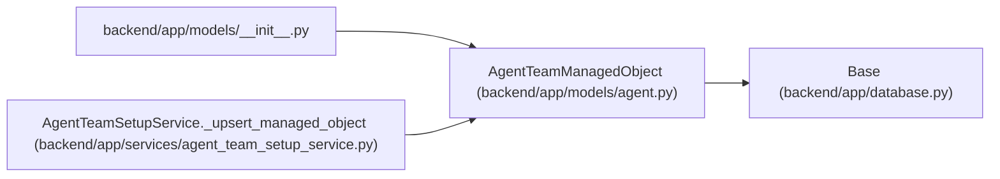

# AgentTeamManagedObject

**Location:** `backend/app/models/agent.py:499`
**Kind:** Class
**Bases:** `Base`
**Module:** [models_agent](../modules/models_agent.md)

## Description

Topology-local mapping for reusable profiles, catalogs, and bindings.

## Attributes

| Name | Type | Default | Description |
|------|------|---------|-------------|
| `id` | `Mapped[int]` | `mapped_column(Integer, primary_key=True, autoincrement=True)` | — |
| `topology_id` | `Mapped[int]` | `mapped_column(Integer, ForeignKey('agent_team_topologies.id', ondelete='RESTRICT'), nullable=False)` | — |
| `object_type` | `Mapped[str]` | `mapped_column(String(30), nullable=False)` | — |
| `logical_key` | `Mapped[str]` | `mapped_column(String(160), nullable=False)` | — |
| `object_id` | `Mapped[int]` | `mapped_column(Integer, nullable=False)` | — |
| `object_revision` | `Mapped[int]` | `mapped_column(Integer, nullable=False)` | — |
| `desired_digest` | `Mapped[str]` | `mapped_column(String(64), nullable=False)` | — |
| `created_at` | `Mapped[datetime]` | `mapped_column(UTCDateTime(), default=utc_now, nullable=False)` | — |
| `updated_at` | `Mapped[datetime]` | `mapped_column(UTCDateTime(), default=utc_now, onupdate=utc_now, nullable=False)` | — |
| `topology` | `Mapped['AgentTeamTopology']` | `relationship('AgentTeamTopology', back_populates='managed_objects')` | — |

## Methods

*No public methods. Inherits from base classes.*

## Relationships

<!-- Auto-generated relationship summary. Do not edit by hand. -->

### Summary

| Module | Methods | Attributes |
|---|---:|---|
| [models_agent](../modules/models_agent.md) | 0 | `created_at`, `desired_digest`, `id`, `logical_key`, `object_id`, `object_revision`, `object_type`, `topology`, `topology_id`, `updated_at` |

### Structure

| Kind | Entity | Module |
|---|---|---|
| Base | `Base` | [app_database](../modules/app_database.md) |

### References

| Reference | Kind | Source | Call sites |
|---|---|---|---:|
| `__init__` | import | [models___init__](../modules/models___init__.md) | — |
| `AgentTeamSetupService._upsert_managed_object` | call | [agent_team_setup_service](../modules/agent_team_setup_service.md) | 1 |
