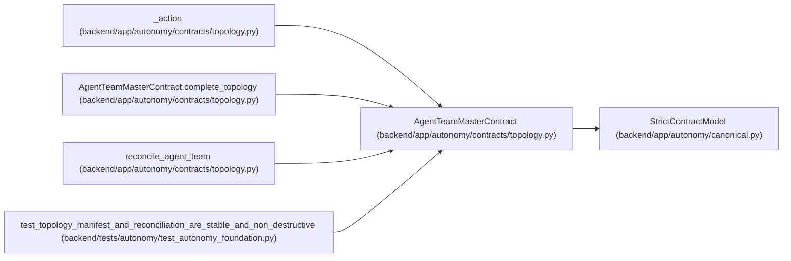

# AgentTeamMasterContract

**Location:** `backend/app/autonomy/contracts/topology.py:196`
**Kind:** Pydantic model
**Bases:** `StrictContractModel`
**Module:** [topology](../modules/topology.md)

## Description

Portable desired state for the PostgreSQL PM/worker/verifier topology.

## Validators

| Method | Scope | Fields | Mode | Options |
|--------|-------|--------|------|---------|
| `complete_topology` | model | — | after | — |

## Attributes

| Name | Type | Wire name | Required | Nullable | Default | Constraints | Examples | Description |
|------|------|-----------|----------|----------|---------|-------------|-------------|----------|
| `schema_version` | `Literal['agent-team-master-v1']` | `schema_version` | No | No | `'agent-team-master-v1'` | — | — | — |
| `topology_key` | `str` | `topology_key` | Yes | No | — | pattern=unknown (LOGICAL_KEY_PATTERN) | — | — |
| `revision` | `int` | `revision` | Yes | No | — | ge=1 | — | — |
| `charter_digest` | `str` | `charter_digest` | Yes | No | — | pattern=unknown (SHA256_PATTERN) | — | — |
| `model_catalog_revision` | `int` | `model_catalog_revision` | Yes | No | — | ge=1 | — | — |
| `credential_sink_ref` | `str` | `credential_sink_ref` | Yes | No | — | max_length=1024; pattern=unknown (OPAQUE_REF_PATTERN) | — | — |
| `members` | `tuple[TopologyMemberContract, ...]` | `members` | Yes | No | — | max_length=256; min_length=1 | — | — |

## Methods

| Method | Signature | Decorators | Description |
|--------|-----------|------------|-------------|
| `complete_topology` | `() -> 'AgentTeamMasterContract'` | `@model_validator(mode='after')` | — |
| `canonical_bytes` | `() -> bytes` | — | — |
| `digest` | `() -> str` | — | — |

## Relationships

<!-- Auto-generated relationship summary. Do not edit by hand. -->

### Summary

| Module | Methods | Attributes |
|---|---:|---|
| [topology](../modules/topology.md) | 3 | `charter_digest`, `credential_sink_ref`, `members`, `model_catalog_revision`, `revision`, `schema_version`, `topology_key` |

### Structure

| Kind | Entity | Module |
|---|---|---|
| Base | `StrictContractModel` | [autonomy_canonical](../modules/autonomy_canonical.md) |

### References

| Reference | Kind | Source | Call sites |
|---|---|---|---:|
| `_action` | type_reference | [topology](../modules/topology.md) | — |
| `AgentTeamMasterContract.complete_topology` | type_reference | [topology](../modules/topology.md) | — |
| `reconcile_agent_team` | type_reference | [topology](../modules/topology.md) | — |
| `test_topology_manifest_and_reconciliation_are_stable_and_non_destructive` | call | [test_autonomy_foundation](../modules/test_autonomy_foundation.md) | 1 |
