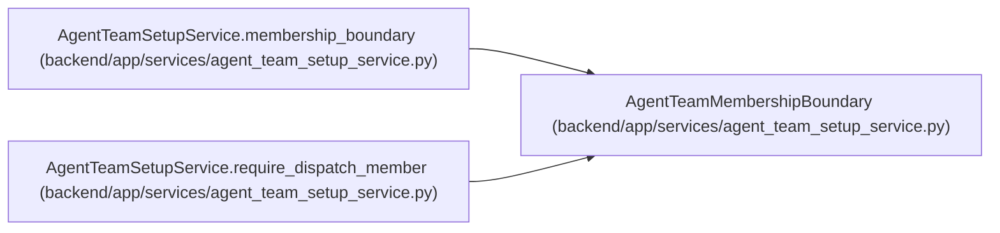

# AgentTeamMembershipBoundary

**Location:** `backend/app/services/agent_team_setup_service.py:115`
**Kind:** Class
**Bases:** —
**Module:** [agent_team_setup_service](../modules/agent_team_setup_service.md)

**Decorators:** `@dataclass(frozen=True)`

## Description

Current topology/revision and active member set for exact-actor routing.

## Attributes

| Name | Type | Default | Description |
|------|------|---------|-------------|
| `topology_id` | `int` | *required* | — |
| `topology_key` | `str` | *required* | — |
| `topology_revision` | `int` | *required* | — |
| `primary_actor_id` | `int \| None` | *required* | — |
| `member_actor_ids` | `frozenset[int]` | *required* | — |
| `runtime_ready_actor_ids` | `frozenset[int]` | *required* | — |

## Methods

*No public methods. Inherits from base classes.*

## Relationships

<!-- Auto-generated relationship summary. Do not edit by hand. -->

### Summary

| Module | Methods | Attributes |
|---|---:|---|
| [agent_team_setup_service](../modules/agent_team_setup_service.md) | 0 | `member_actor_ids`, `primary_actor_id`, `runtime_ready_actor_ids`, `topology_id`, `topology_key`, `topology_revision` |

### References

| Reference | Kind | Source | Call sites |
|---|---|---|---:|
| `AgentTeamSetupService.membership_boundary` | call | [agent_team_setup_service](../modules/agent_team_setup_service.md) | 1 |
| `AgentTeamSetupService.membership_boundary` | type_reference | [agent_team_setup_service](../modules/agent_team_setup_service.md) | — |
| `AgentTeamSetupService.require_dispatch_member` | type_reference | [agent_team_setup_service](../modules/agent_team_setup_service.md) | — |
