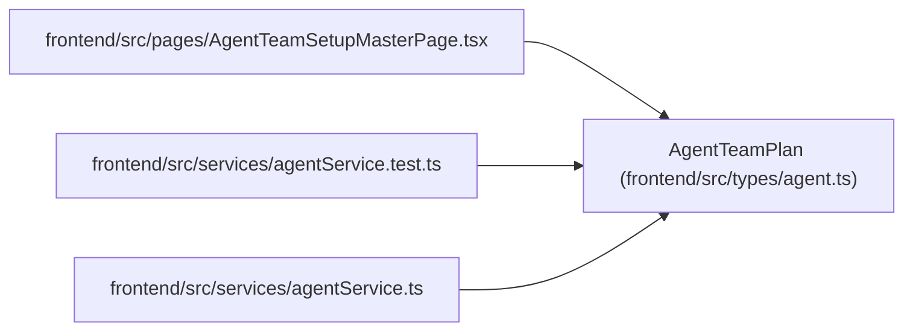

# AgentTeamPlan

**Location:** `frontend/src/types/agent.ts:718`
**Kind:** Class
**Bases:** —
**Module:** [types_agent](../modules/types_agent.md)

## Description

_Auto-generated from `AgentTeamPlan` in `frontend/src/types/agent.ts`._

## Attributes

| Name | Type | Required | Default | Description |
|------|------|----------|---------|-------------|
| `schema_version` | `'agent-team-reconciliation-plan-v1'` | Yes | — | — |
| `topology_key` | `string` | Yes | — | — |
| `expected_topology_revision` | `number` | Yes | — | — |
| `manifest_digest` | `string` | Yes | — | — |
| `plan_digest` | `string` | Yes | — | — |
| `actions` | `AgentTeamPlanAction[]` | Yes | — | — |
| `blocker_codes` | `string[]` | Yes | — | — |

## Methods

*No public methods. Inherits from base classes.*

## Relationships

<!-- Auto-generated relationship summary. Do not edit by hand. -->

### Summary

| Module | Methods | Attributes |
|---|---:|---|
| [types_agent](../modules/types_agent.md) | 0 | `actions`, `blocker_codes`, `expected_topology_revision`, `manifest_digest`, `plan_digest`, `schema_version`, `topology_key` |

### References

| Reference | Kind | Source | Call sites |
|---|---|---|---:|
| `AgentTeamSetupMasterPage` | import | [AgentTeamSetupMasterPage](../modules/AgentTeamSetupMasterPage.md) | — |
| `agentService.test` | import | [agentService.test](../modules/agentService.test.md) | — |
| `agentService` | import | [agentService](../modules/agentService.md) | — |
