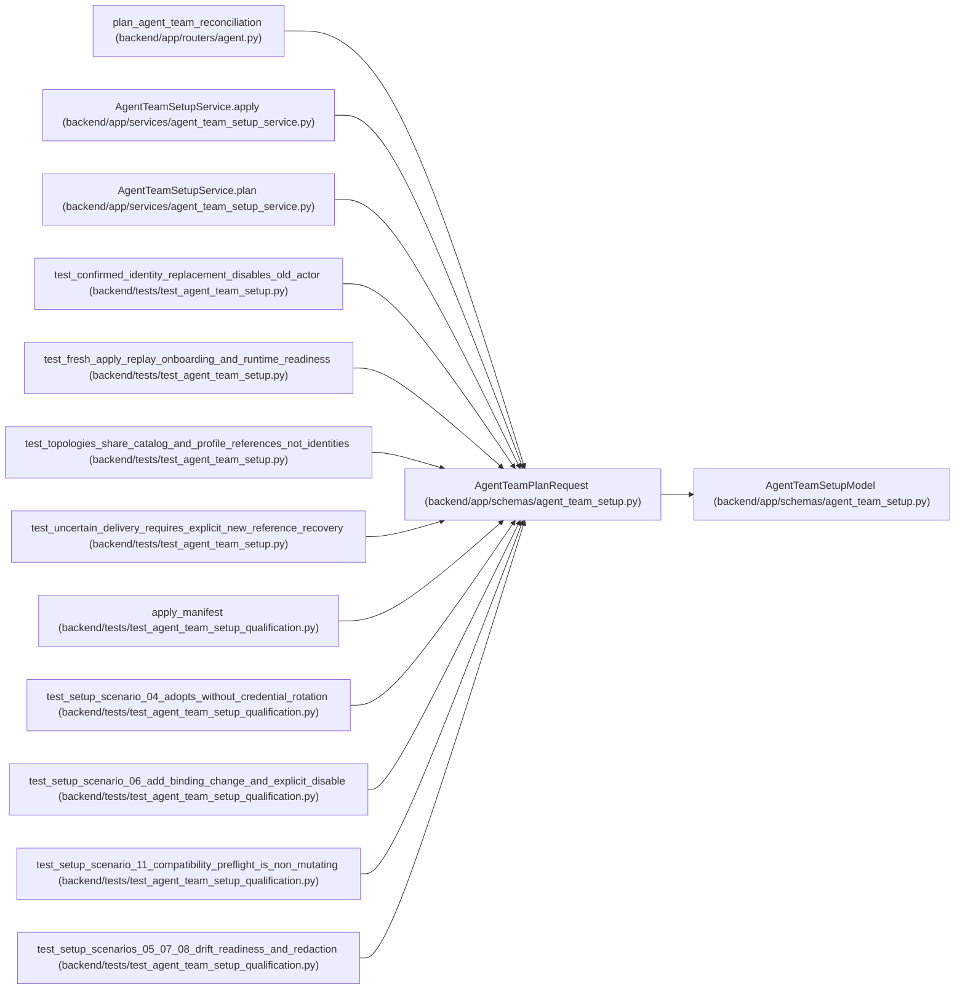

# AgentTeamPlanRequest

**Location:** `backend/app/schemas/agent_team_setup.py:728`
**Kind:** Pydantic model
**Bases:** `AgentTeamSetupModel`
**Module:** [agent_team_setup](../modules/agent_team_setup.md)

## Description

_Auto-generated from `AgentTeamPlanRequest` in `backend/app/schemas/agent_team_setup.py`._

## Attributes

| Name | Type | Wire name | Required | Nullable | Default | Constraints | Examples | Description |
|------|------|-----------|----------|----------|---------|-------------|-------------|----------|
| `manifest` | `AgentTeamMaster` | `manifest` | Yes | No | — | — | — | — |
| `expected_topology_revision` | `int` | `expected_topology_revision` | Yes | No | — | ge=0 | — | — |

## Methods

*No public methods. Inherits from base classes.*

## Relationships

<!-- Auto-generated relationship summary. Do not edit by hand. -->

### Summary

| Module | Methods | Attributes |
|---|---:|---|
| [agent_team_setup](../modules/agent_team_setup.md) | 0 | `expected_topology_revision`, `manifest` |

### Structure

| Kind | Entity | Module |
|---|---|---|
| Base | `AgentTeamSetupModel` | [agent_team_setup](../modules/agent_team_setup.md) |

### References

| Reference | Kind | Source | Call sites |
|---|---|---|---:|
| `plan_agent_team_reconciliation` | type_reference | [routers_agent](../modules/routers_agent.md) | — |
| `AgentTeamSetupService.apply` | call | [agent_team_setup_service](../modules/agent_team_setup_service.md) | 1 |
| `AgentTeamSetupService.plan` | type_reference | [agent_team_setup_service](../modules/agent_team_setup_service.md) | — |
| `test_confirmed_identity_replacement_disables_old_actor` | call | [test_agent_team_setup](../modules/test_agent_team_setup.md) | 2 |
| `test_fresh_apply_replay_onboarding_and_runtime_readiness` | call | [test_agent_team_setup](../modules/test_agent_team_setup.md) | 1 |
| `test_topologies_share_catalog_and_profile_references_not_identities` | call | [test_agent_team_setup](../modules/test_agent_team_setup.md) | 1 |
| `test_uncertain_delivery_requires_explicit_new_reference_recovery` | call | [test_agent_team_setup](../modules/test_agent_team_setup.md) | 2 |
| `apply_manifest` | call | [test_agent_team_setup_qualification](../modules/test_agent_team_setup_qualification.md) | 1 |
| `test_setup_scenario_04_adopts_without_credential_rotation` | call | [test_agent_team_setup_qualification](../modules/test_agent_team_setup_qualification.md) | 1 |
| `test_setup_scenario_06_add_binding_change_and_explicit_disable` | call | [test_agent_team_setup_qualification](../modules/test_agent_team_setup_qualification.md) | 1 |
| `test_setup_scenario_11_compatibility_preflight_is_non_mutating` | call | [test_agent_team_setup_qualification](../modules/test_agent_team_setup_qualification.md) | 1 |
| `test_setup_scenarios_05_07_08_drift_readiness_and_redaction` | call | [test_agent_team_setup_qualification](../modules/test_agent_team_setup_qualification.md) | 1 |
