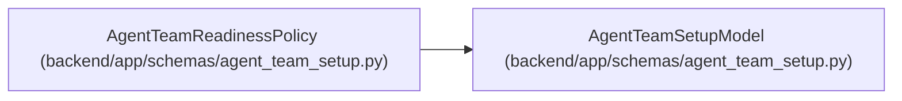

# AgentTeamReadinessPolicy

**Location:** `backend/app/schemas/agent_team_setup.py:252`
**Kind:** Pydantic model
**Bases:** `AgentTeamSetupModel`
**Module:** [agent_team_setup](../modules/agent_team_setup.md)

## Description

Backend-owned minimum topology needed before runtime readiness.

## Attributes

| Name | Type | Wire name | Required | Nullable | Default | Constraints | Examples | Description |
|------|------|-----------|----------|----------|---------|-------------|-------------|----------|
| `minimum_execution_workers` | `int` | `minimum_execution_workers` | No | No | `1` | ge=1; le=64 | — | — |
| `require_independent_verifier_when_assessed` | `bool` | `require_independent_verifier_when_assessed` | No | No | `True` | — | — | — |
| `maximum_runtime_staleness_seconds` | `int` | `maximum_runtime_staleness_seconds` | No | No | `300` | ge=30; le=86400 | — | — |

## Methods

*No public methods. Inherits from base classes.*

## Relationships

<!-- Auto-generated relationship summary. Do not edit by hand. -->

### Summary

| Module | Methods | Attributes |
|---|---:|---|
| [agent_team_setup](../modules/agent_team_setup.md) | 0 | `maximum_runtime_staleness_seconds`, `minimum_execution_workers`, `require_independent_verifier_when_assessed` |

### Structure

| Kind | Entity | Module |
|---|---|---|
| Base | `AgentTeamSetupModel` | [agent_team_setup](../modules/agent_team_setup.md) |
