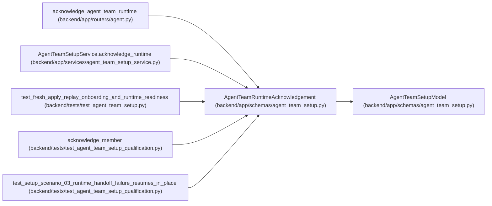

# AgentTeamRuntimeAcknowledgement

**Location:** `backend/app/schemas/agent_team_setup.py:801`
**Kind:** Pydantic model
**Bases:** `AgentTeamSetupModel`
**Module:** [agent_team_setup](../modules/agent_team_setup.md)

## Description

_Auto-generated from `AgentTeamRuntimeAcknowledgement` in `backend/app/schemas/agent_team_setup.py`._

## Validators

| Method | Scope | Fields | Mode | Options |
|--------|-------|--------|------|---------|
| `normalize_ack_sequences` | field | server_features, supported_assignment_modes | after | — |
| `validate_binding_revisions` | field | model_binding_revisions | after | — |

## Attributes

| Name | Type | Wire name | Required | Nullable | Default | Constraints | Examples | Description |
|------|------|-----------|----------|----------|---------|-------------|-------------|----------|
| `schema_version` | `Literal['agent-team-runtime-ack-v1']` | `schema_version` | No | No | `AGENT_TEAM_ACK_SCHEMA_VERSION` | — | — | — |
| `topology_key` | `str` | `topology_key` | Yes | No | — | pattern=unknown (STABLE_KEY_PATTERN) | — | — |
| `topology_revision` | `int` | `topology_revision` | Yes | No | — | ge=1 | — | — |
| `actor_key` | `str` | `actor_key` | Yes | No | — | pattern=unknown (STABLE_KEY_PATTERN) | — | — |
| `role` | `Literal['pm', 'worker', 'verifier']` | `role` | Yes | No | — | — | — | — |
| `skill_package` | `AgentTeamSkillPackage` | `skill_package` | Yes | No | — | — | — | — |
| `profile_revision` | `str` | `profile_revision` | Yes | No | — | max_length=128; min_length=1 | — | — |
| `model_binding_revisions` | `dict[str, int]` | `model_binding_revisions` | Yes | No | — | max_length=16; min_length=1 | — | — |
| `server_features` | `tuple[str, ...]` | `server_features` | Yes | No | — | max_length=64; min_length=1 | — | — |
| `supported_assignment_modes` | `tuple[str, ...]` | `supported_assignment_modes` | Yes | No | — | max_length=4; min_length=1 | — | — |

## Methods

| Method | Signature | Decorators | Description |
|--------|-----------|------------|-------------|
| `normalize_ack_sequences` | `(value: tuple[str, ...], info: Any) -> tuple[str, ...]` | `@field_validator('server_features', 'supported_assignment_modes')`, `@classmethod` | — |
| `validate_binding_revisions` | `(value: dict[str, int]) -> dict[str, int]` | `@field_validator('model_binding_revisions')`, `@classmethod` | — |

## Relationships

<!-- Auto-generated relationship summary. Do not edit by hand. -->

### Summary

| Module | Methods | Attributes |
|---|---:|---|
| [agent_team_setup](../modules/agent_team_setup.md) | 2 | `actor_key`, `model_binding_revisions`, `profile_revision`, `role`, `schema_version`, `server_features`, `skill_package`, `supported_assignment_modes`, `topology_key`, `topology_revision` |

### Structure

| Kind | Entity | Module |
|---|---|---|
| Base | `AgentTeamSetupModel` | [agent_team_setup](../modules/agent_team_setup.md) |

### References

| Reference | Kind | Source | Call sites |
|---|---|---|---:|
| `acknowledge_agent_team_runtime` | type_reference | [routers_agent](../modules/routers_agent.md) | — |
| `AgentTeamSetupService.acknowledge_runtime` | type_reference | [agent_team_setup_service](../modules/agent_team_setup_service.md) | — |
| `test_fresh_apply_replay_onboarding_and_runtime_readiness` | call | [test_agent_team_setup](../modules/test_agent_team_setup.md) | 1 |
| `acknowledge_member` | call | [test_agent_team_setup_qualification](../modules/test_agent_team_setup_qualification.md) | 1 |
| `test_setup_scenario_03_runtime_handoff_failure_resumes_in_place` | call | [test_agent_team_setup_qualification](../modules/test_agent_team_setup_qualification.md) | 1 |
