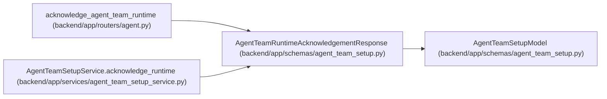

# AgentTeamRuntimeAcknowledgementResponse

**Location:** `backend/app/schemas/agent_team_setup.py:846`
**Kind:** Pydantic model
**Bases:** `AgentTeamSetupModel`
**Module:** [agent_team_setup](../modules/agent_team_setup.md)

## Description

_Auto-generated from `AgentTeamRuntimeAcknowledgementResponse` in `backend/app/schemas/agent_team_setup.py`._

## Attributes

| Name | Type | Wire name | Required | Nullable | Default | Constraints | Examples | Description |
|------|------|-----------|----------|----------|---------|-------------|-------------|----------|
| `schema_version` | `Literal['agent-team-runtime-ack-receipt-v1']` | `schema_version` | No | No | `'agent-team-runtime-ack-receipt-v1'` | — | — | — |
| `topology_key` | `str` | `topology_key` | Yes | No | — | pattern=unknown (STABLE_KEY_PATTERN) | — | — |
| `topology_revision` | `int` | `topology_revision` | Yes | No | — | ge=1 | — | — |
| `actor_key` | `str` | `actor_key` | Yes | No | — | pattern=unknown (STABLE_KEY_PATTERN) | — | — |
| `actor_id` | `int` | `actor_id` | Yes | No | — | ge=1 | — | — |
| `lifecycle_state` | `AgentTeamMemberLifecycle` | `lifecycle_state` | Yes | No | — | — | — | — |
| `acknowledgement_digest` | `str` | `acknowledgement_digest` | Yes | No | — | pattern=unknown (SHA256_PATTERN) | — | — |
| `topology_runtime_ready` | `bool` | `topology_runtime_ready` | Yes | No | — | — | — | — |
| `blocker_codes` | `tuple[str, ...]` | `blocker_codes` | No | No | `()` | max_length=unknown (MAX_AGENT_TEAM_BLOCKERS) | — | — |

## Methods

*No public methods. Inherits from base classes.*

## Relationships

<!-- Auto-generated relationship summary. Do not edit by hand. -->

### Summary

| Module | Methods | Attributes |
|---|---:|---|
| [agent_team_setup](../modules/agent_team_setup.md) | 0 | `acknowledgement_digest`, `actor_id`, `actor_key`, `blocker_codes`, `lifecycle_state`, `schema_version`, `topology_key`, `topology_revision`, `topology_runtime_ready` |

### Structure

| Kind | Entity | Module |
|---|---|---|
| Base | `AgentTeamSetupModel` | [agent_team_setup](../modules/agent_team_setup.md) |

### References

| Reference | Kind | Source | Call sites |
|---|---|---|---:|
| `acknowledge_agent_team_runtime` | type_reference | [routers_agent](../modules/routers_agent.md) | — |
| `AgentTeamSetupService.acknowledge_runtime` | call | [agent_team_setup_service](../modules/agent_team_setup_service.md) | 2 |
| `AgentTeamSetupService.acknowledge_runtime` | type_reference | [agent_team_setup_service](../modules/agent_team_setup_service.md) | — |
