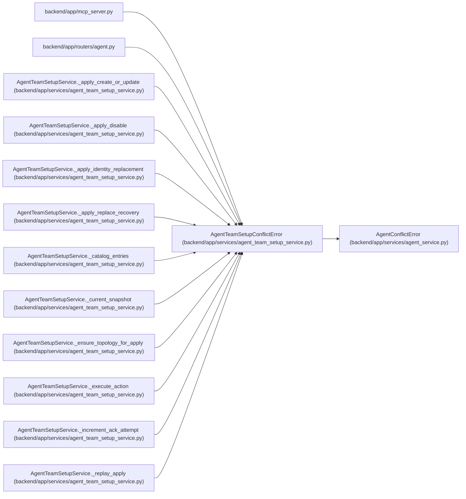

# AgentTeamSetupConflictError

**Location:** `backend/app/services/agent_team_setup_service.py:101`
**Kind:** Class
**Bases:** `AgentConflictError`
**Module:** [agent_team_setup_service](../modules/agent_team_setup_service.md)

## Description

Stable conflict envelope shared by setup REST and MCP reads.

## Attributes

*No annotated attributes found.*

## Methods

| Method | Signature | Decorators | Description |
|--------|-----------|------------|-------------|
| `__init__` | `(code: str, message: str, **context: Any)` | — | — |
| `detail` | `() -> dict[str, Any]` | — | — |

## Relationships

<!-- Auto-generated relationship summary. Do not edit by hand. -->

### Summary

| Module | Methods | Attributes |
|---|---:|---|
| [agent_team_setup_service](../modules/agent_team_setup_service.md) | 2 | — |

### Structure

| Kind | Entity | Module |
|---|---|---|
| Base | `AgentConflictError` | [agent_service](../modules/agent_service.md) |

### References

| Reference | Kind | Source | Call sites |
|---|---|---|---:|
| `mcp_server` | import | [mcp_server](../modules/mcp_server.md) | — |
| `agent` | import | [routers_agent](../modules/routers_agent.md) | — |
| `AgentTeamSetupService._apply_create_or_update` | call | [agent_team_setup_service](../modules/agent_team_setup_service.md) | 4 |
| `AgentTeamSetupService._apply_disable` | call | [agent_team_setup_service](../modules/agent_team_setup_service.md) | 2 |
| `AgentTeamSetupService._apply_identity_replacement` | call | [agent_team_setup_service](../modules/agent_team_setup_service.md) | 4 |
| `AgentTeamSetupService._apply_replace_recovery` | call | [agent_team_setup_service](../modules/agent_team_setup_service.md) | 2 |
| `AgentTeamSetupService._catalog_entries` | call | [agent_team_setup_service](../modules/agent_team_setup_service.md) | 1 |
| `AgentTeamSetupService._current_snapshot` | call | [agent_team_setup_service](../modules/agent_team_setup_service.md) | 1 |
| `AgentTeamSetupService._ensure_topology_for_apply` | call | [agent_team_setup_service](../modules/agent_team_setup_service.md) | 2 |
| `AgentTeamSetupService._execute_action` | call | [agent_team_setup_service](../modules/agent_team_setup_service.md) | 3 |
| `AgentTeamSetupService._increment_ack_attempt` | call | [agent_team_setup_service](../modules/agent_team_setup_service.md) | 1 |
| `AgentTeamSetupService._replay_apply` | call | [agent_team_setup_service](../modules/agent_team_setup_service.md) | 1 |

> References: showing 12 of 22 logical references; 10 omitted by the 12-row generated summary limit.
