# AgentTeamSetupModel

**Location:** `backend/app/schemas/agent_team_setup.py:155`
**Kind:** Pydantic model
**Bases:** `StrictContractModel`
**Module:** [agent_team_setup](../modules/agent_team_setup.md)

## Description

Strict base with JSON-schema metadata shared by setup contracts.

## Model Configuration

| Setting | Value | Source |
|---------|-------|--------|
| `extra` | `'forbid'` | model_config |
| `frozen` | `True` | model_config |
| `str_strip_whitespace` | `True` | model_config |
| `validate_default` | `True` | model_config |
| `allow_inf_nan` | `False` | model_config |
| `json_schema_extra` | `{'x-secret-free': True}` | model_config |

## Attributes

*No annotated attributes found.*

## Methods

*No public methods. Inherits from base classes.*

## Relationships

```mermaid
flowchart LR
    n0["AgentTeamSetupModel (backend/app/schemas/agent_team_setup.py)"]
    n1["StrictContractModel (backend/app/autonomy/canonical.py)"]
    n2["AgentTeamActionReceipt (backend/app/schemas/agent_team_setup.py)"]
    n3["AgentTeamApplyRequest (backend/app/schemas/agent_team_setup.py)"]
    n4["AgentTeamApplyResponse (backend/app/schemas/agent_team_setup.py)"]
    n5["AgentTeamCurrentMember (backend/app/schemas/agent_team_setup.py)"]
    n6["AgentTeamCurrentSnapshot (backend/app/schemas/agent_team_setup.py)"]
    n7["AgentTeamDispatchAvailability (backend/app/schemas/agent_team_setup.py)"]
    n8["AgentTeamManifestRequest (backend/app/schemas/agent_team_setup.py)"]
    n9["AgentTeamMaster (backend/app/schemas/agent_team_setup.py)"]
    n10["AgentTeamMemberSpec (backend/app/schemas/agent_team_setup.py)"]
    n11["AgentTeamMemberStatus (backend/app/schemas/agent_team_setup.py)"]
    n12["AgentTeamPlanAction (backend/app/schemas/agent_team_setup.py)"]
    n13["AgentTeamPlanRequest (backend/app/schemas/agent_team_setup.py)"]
    n0 --> n1
    n2 --> n0
    n3 --> n0
    n4 --> n0
    n5 --> n0
    n6 --> n0
    n7 --> n0
    n8 --> n0
    n9 --> n0
    n10 --> n0
    n11 --> n0
    n12 --> n0
    n13 --> n0
    click n0 "../modules/agent_team_setup.md"
    click n1 "../modules/autonomy_canonical.md"
    click n2 "../modules/agent_team_setup.md"
    click n3 "../modules/agent_team_setup.md"
    click n4 "../modules/agent_team_setup.md"
    click n5 "../modules/agent_team_setup.md"
    click n6 "../modules/agent_team_setup.md"
    click n7 "../modules/agent_team_setup.md"
    click n8 "../modules/agent_team_setup.md"
    click n9 "../modules/agent_team_setup.md"
    click n10 "../modules/agent_team_setup.md"
    click n11 "../modules/agent_team_setup.md"
    click n12 "../modules/agent_team_setup.md"
    click n13 "../modules/agent_team_setup.md"
```

<!-- Auto-generated relationship summary. Do not edit by hand. -->

### Summary

| Module | Methods | Attributes |
|---|---:|---|
| [agent_team_setup](../modules/agent_team_setup.md) | 0 | — |

### Structure

| Kind | Entity | Module |
|---|---|---|
| Base | `StrictContractModel` | [autonomy_canonical](../modules/autonomy_canonical.md) |
| Subclass | `AgentTeamActionReceipt` | [agent_team_setup](../modules/agent_team_setup.md) |
| Subclass | `AgentTeamApplyRequest` | [agent_team_setup](../modules/agent_team_setup.md) |
| Subclass | `AgentTeamApplyResponse` | [agent_team_setup](../modules/agent_team_setup.md) |
| Subclass | `AgentTeamCurrentMember` | [agent_team_setup](../modules/agent_team_setup.md) |
| Subclass | `AgentTeamCurrentSnapshot` | [agent_team_setup](../modules/agent_team_setup.md) |
| Subclass | `AgentTeamDispatchAvailability` | [agent_team_setup](../modules/agent_team_setup.md) |
| Subclass | `AgentTeamManifestRequest` | [agent_team_setup](../modules/agent_team_setup.md) |
| Subclass | `AgentTeamMaster` | [agent_team_setup](../modules/agent_team_setup.md) |
| Subclass | `AgentTeamMemberSpec` | [agent_team_setup](../modules/agent_team_setup.md) |
| Subclass | `AgentTeamMemberStatus` | [agent_team_setup](../modules/agent_team_setup.md) |
| Subclass | `AgentTeamPlanAction` | [agent_team_setup](../modules/agent_team_setup.md) |
| Subclass | `AgentTeamPlanRequest` | [agent_team_setup](../modules/agent_team_setup.md) |
