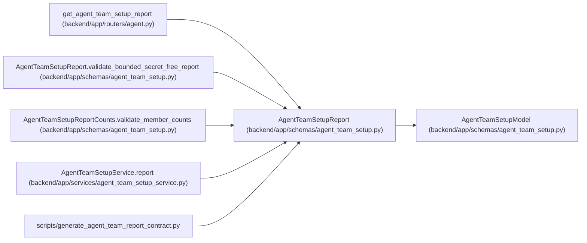

# AgentTeamSetupReport

**Location:** `backend/app/schemas/agent_team_setup.py:1060`
**Kind:** Pydantic model
**Bases:** `AgentTeamSetupModel`
**Module:** [agent_team_setup](../modules/agent_team_setup.md)

## Description

Portable redacted topology report derived only from current server state.

## Validators

| Method | Scope | Fields | Mode | Options |
|--------|-------|--------|------|---------|
| `validate_bounded_secret_free_report` | model | — | after | — |

## Attributes

| Name | Type | Wire name | Required | Nullable | Default | Constraints | Examples | Description |
|------|------|-----------|----------|----------|---------|-------------|-------------|----------|
| `schema_version` | `Literal['agent-team-setup-report-v1']` | `schema_version` | No | No | `AGENT_TEAM_REPORT_SCHEMA_VERSION` | — | — | — |
| `generated_at` | `datetime` | `generated_at` | Yes | No | — | — | — | — |
| `topology_key` | `str \| None` | `topology_key` | No | Yes | `None` | pattern=unknown (STABLE_KEY_PATTERN) | — | — |
| `topology_revision` | `int \| None` | `topology_revision` | No | Yes | `None` | ge=1 | — | — |
| `manifest_digest` | `str \| None` | `manifest_digest` | No | Yes | `None` | pattern=unknown (SHA256_PATTERN) | — | — |
| `topology_state` | `Literal['absent', 'configured', 'onboarding', 'runtime_ready', 'blocked', 'disabled']` | `topology_state` | Yes | No | — | — | — | — |
| `runtime_ready` | `bool` | `runtime_ready` | Yes | No | — | — | — | — |
| `availability` | `Literal['availability_unknown']` | `availability` | No | No | `'availability_unknown'` | — | — | — |
| `status_digest` | `str` | `status_digest` | Yes | No | — | pattern=unknown (SHA256_PATTERN) | — | — |
| `counts` | `AgentTeamSetupReportCounts` | `counts` | Yes | No | — | — | — | — |
| `evidence` | `AgentTeamSetupReportEvidence` | `evidence` | Yes | No | — | — | — | — |
| `dispatch_context` | `AgentTeamDispatchAvailability` | `dispatch_context` | No | No | factory: `AgentTeamDispatchAvailability` | — | — | — |
| `blocker_codes` | `tuple[str, ...]` | `blocker_codes` | No | No | `()` | max_length=unknown (MAX_AGENT_TEAM_BLOCKERS) | — | — |

## Methods

| Method | Signature | Decorators | Description |
|--------|-----------|------------|-------------|
| `validate_bounded_secret_free_report` | `() -> 'AgentTeamSetupReport'` | `@model_validator(mode='after')` | — |

## Relationships

<!-- Auto-generated relationship summary. Do not edit by hand. -->

### Summary

| Module | Methods | Attributes |
|---|---:|---|
| [agent_team_setup](../modules/agent_team_setup.md) | 1 | `availability`, `blocker_codes`, `counts`, `dispatch_context`, `evidence`, `generated_at`, `manifest_digest`, `runtime_ready`, `schema_version`, `status_digest`, `topology_key`, `topology_revision` |

### Structure

| Kind | Entity | Module |
|---|---|---|
| Base | `AgentTeamSetupModel` | [agent_team_setup](../modules/agent_team_setup.md) |

### References

| Reference | Kind | Source | Call sites |
|---|---|---|---:|
| `get_agent_team_setup_report` | type_reference | [routers_agent](../modules/routers_agent.md) | — |
| `AgentTeamSetupReport.validate_bounded_secret_free_report` | type_reference | [agent_team_setup](../modules/agent_team_setup.md) | — |
| `AgentTeamSetupReportCounts.validate_member_counts` | type_reference | [agent_team_setup](../modules/agent_team_setup.md) | — |
| `AgentTeamSetupService.report` | call | [agent_team_setup_service](../modules/agent_team_setup_service.md) | 1 |
| `AgentTeamSetupService.report` | type_reference | [agent_team_setup_service](../modules/agent_team_setup_service.md) | — |
| `generate_agent_team_report_contract` | import | [generate_agent_team_report_contract](../modules/generate_agent_team_report_contract.md) | — |
