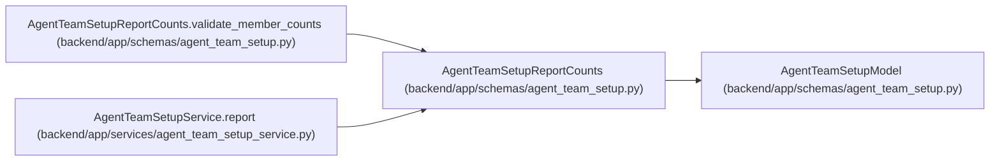

# AgentTeamSetupReportCounts

**Location:** `backend/app/schemas/agent_team_setup.py:975`
**Kind:** Pydantic model
**Bases:** `AgentTeamSetupModel`
**Module:** [agent_team_setup](../modules/agent_team_setup.md)

## Description

Bounded lifecycle and current-work counts without member internals.

## Validators

| Method | Scope | Fields | Mode | Options |
|--------|-------|--------|------|---------|
| `validate_member_counts` | model | — | after | — |

## Attributes

| Name | Type | Wire name | Required | Nullable | Default | Constraints | Examples | Description |
|------|------|-----------|----------|----------|---------|-------------|-------------|----------|
| `desired` | `int` | `desired` | Yes | No | — | ge=0; le=unknown (MAX_AGENT_TEAM_MEMBERS) | — | — |
| `configured` | `int` | `configured` | Yes | No | — | ge=0; le=unknown (MAX_AGENT_TEAM_MEMBERS) | — | — |
| `credential_delivered` | `int` | `credential_delivered` | Yes | No | — | ge=0; le=unknown (MAX_AGENT_TEAM_MEMBERS) | — | — |
| `onboarding` | `int` | `onboarding` | Yes | No | — | ge=0; le=unknown (MAX_AGENT_TEAM_MEMBERS) | — | — |
| `connected` | `int` | `connected` | Yes | No | — | ge=0; le=unknown (MAX_AGENT_TEAM_MEMBERS) | — | — |
| `runtime_ready` | `int` | `runtime_ready` | Yes | No | — | ge=0; le=unknown (MAX_AGENT_TEAM_MEMBERS) | — | — |
| `blocked` | `int` | `blocked` | Yes | No | — | ge=0; le=unknown (MAX_AGENT_TEAM_MEMBERS) | — | — |
| `disabled` | `int` | `disabled` | Yes | No | — | ge=0; le=unknown (MAX_AGENT_TEAM_MEMBERS) | — | — |
| `queued_assignments` | `int` | `queued_assignments` | Yes | No | — | ge=0 | — | — |
| `accepted_assignments` | `int` | `accepted_assignments` | Yes | No | — | ge=0 | — | — |
| `running_runs` | `int` | `running_runs` | Yes | No | — | ge=0 | — | — |

## Methods

| Method | Signature | Decorators | Description |
|--------|-----------|------------|-------------|
| `validate_member_counts` | `() -> 'AgentTeamSetupReportCounts'` | `@model_validator(mode='after')` | — |

## Relationships

<!-- Auto-generated relationship summary. Do not edit by hand. -->

### Summary

| Module | Methods | Attributes |
|---|---:|---|
| [agent_team_setup](../modules/agent_team_setup.md) | 1 | `accepted_assignments`, `blocked`, `configured`, `connected`, `credential_delivered`, `desired`, `disabled`, `onboarding`, `queued_assignments`, `running_runs`, `runtime_ready` |

### Structure

| Kind | Entity | Module |
|---|---|---|
| Base | `AgentTeamSetupModel` | [agent_team_setup](../modules/agent_team_setup.md) |

### References

| Reference | Kind | Source | Call sites |
|---|---|---|---:|
| `AgentTeamSetupReportCounts.validate_member_counts` | type_reference | [agent_team_setup](../modules/agent_team_setup.md) | — |
| `AgentTeamSetupService.report` | call | [agent_team_setup_service](../modules/agent_team_setup_service.md) | 1 |
