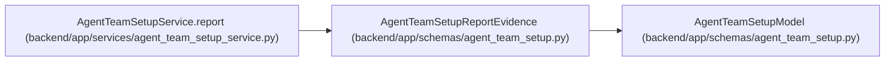

# AgentTeamSetupReportEvidence

**Location:** `backend/app/schemas/agent_team_setup.py:1016`
**Kind:** Pydantic model
**Bases:** `AgentTeamSetupModel`
**Module:** [agent_team_setup](../modules/agent_team_setup.md)

## Description

Durable reconciliation evidence summarized without action payloads.

## Attributes

| Name | Type | Wire name | Required | Nullable | Default | Constraints | Examples | Description |
|------|------|-----------|----------|----------|---------|-------------|-------------|----------|
| `apply_runs` | `int` | `apply_runs` | Yes | No | — | ge=0 | — | — |
| `action_receipts` | `int` | `action_receipts` | Yes | No | — | ge=0 | — | — |
| `latest_apply_id` | `str \| None` | `latest_apply_id` | No | Yes | `None` | pattern='^[0-9a-f]{32}$' | — | — |
| `latest_apply_status` | `Literal['running', 'completed', 'partial', 'blocked'] \| None` | `latest_apply_status` | No | Yes | `None` | — | — | — |
| `pending_actions` | `int` | `pending_actions` | Yes | No | — | ge=0; le=unknown (MAX_AGENT_TEAM_ACTIONS) | — | — |

## Methods

*No public methods. Inherits from base classes.*

## Relationships

<!-- Auto-generated relationship summary. Do not edit by hand. -->

### Summary

| Module | Methods | Attributes |
|---|---:|---|
| [agent_team_setup](../modules/agent_team_setup.md) | 0 | `action_receipts`, `apply_runs`, `latest_apply_id`, `latest_apply_status`, `pending_actions` |

### Structure

| Kind | Entity | Module |
|---|---|---|
| Base | `AgentTeamSetupModel` | [agent_team_setup](../modules/agent_team_setup.md) |

### References

| Reference | Kind | Source | Call sites |
|---|---|---|---:|
| `AgentTeamSetupService.report` | call | [agent_team_setup_service](../modules/agent_team_setup_service.md) | 1 |
