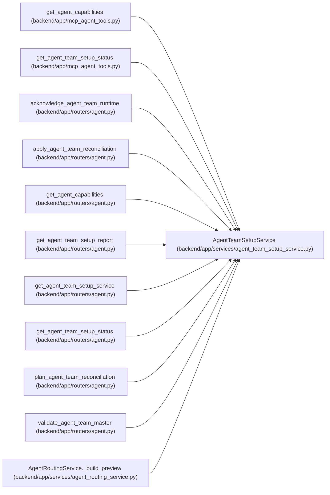

# AgentTeamSetupService

**Location:** `backend/app/services/agent_team_setup_service.py:264`
**Kind:** Class
**Bases:** —
**Module:** [agent_team_setup_service](../modules/agent_team_setup_service.md)

## Description

Reconcile one portable topology without making the UI a control plane.

## Attributes

*No annotated attributes found.*

## Methods

| Method | Signature | Decorators | Description |
|--------|-----------|------------|-------------|
| `__init__` | `(db: AsyncSession, *, credential_sink: AgentTeamCredentialSink \| None = None, skill_catalog_path: Path \| None = None)` | — | — |
| `_require_operator` | `(actor: AgentActor) -> None` | `@staticmethod` | — |
| `_principal_key` | `(actor: AgentActor) -> str` | `@staticmethod` | — |
| `_supported_features` | `() -> frozenset[str]` | `@staticmethod` | — |
| `_skill_catalog` | `() -> SkillBundleCatalogResponse` | — | — |
| `_compatibility_blockers` | *(async)* `(manifest: AgentTeamMaster) -> tuple[str, ...]` | — | — |
| `validate` | *(async)* `(actor: AgentActor, request: AgentTeamManifestRequest) -> AgentTeamValidateResponse` | — | Validate canonical bytes plus current server/package compatibility. |
| `_topology` | *(async)* `(topology_key: str, *, for_update: bool = False, load_members: bool = False) -> AgentTeamTopology \| None` | — | — |
| `_current_snapshot` | *(async)* `(manifest: AgentTeamMaster) -> AgentTeamCurrentSnapshot` | — | — |
| `_action_with` | `(action: AgentTeamPlanAction, **updates: Any) -> AgentTeamPlanAction` | `@staticmethod` | — |
| `_actor_by_name` | *(async)* `(name: str) -> AgentActor \| None` | — | — |
| `_actual_member_drift` | `(actor: AgentActor, desired: AgentTeamMemberSpec) -> tuple[tuple[str, ...], bool]` | `@staticmethod` | — |
| `plan` | *(async)* `(actor: AgentActor, request: AgentTeamPlanRequest) -> AgentTeamReconciliationPlan` | — | Return the exact current redacted plan without mutating any object. |
| `_find_apply_run` | *(async)* `(*, principal_key: str, idempotency_key: str) -> AgentTeamApplyRun \| None` | — | — |
| `_apply_request_digest` | `(request: AgentTeamApplyRequest, command: AgentPlanningCommandContext) -> str` | `@staticmethod` | — |
| `_receipt_from_record` | `(record: AgentTeamActionReceiptRecord) -> AgentTeamActionReceipt` | `@staticmethod` | — |
| `_replay_apply` | *(async)* `(run: AgentTeamApplyRun, *, request_digest: str) -> AgentTeamApplyResponse \| None` | — | — |
| `_ensure_topology_for_apply` | *(async)* `(manifest: AgentTeamMaster, run: AgentTeamApplyRun) -> tuple[AgentTeamTopology, bool]` | — | — |
| `_resolve_profile` | *(async)* `(member: AgentTeamMemberSpec) -> TeamMemberProfile` | — | — |
| `_catalog_entries` | *(async)* `(member: AgentTeamMemberSpec) -> dict[str, AgentModelCatalogEntry]` | — | — |
| `_reconcile_bindings` | *(async)* `(*, topology: AgentTeamTopology, actor: AgentActor, member: AgentTeamMemberSpec, entries: dict[str, AgentModelCatalogEntry], allow_binding_replacement: bool = False) -> dict[str, int]` | — | — |
| `_upsert_managed_object` | *(async)* `(*, topology: AgentTeamTopology, object_type: str, logical_key: str, object_id: int, object_revision: int, desired_digest: str, allow_object_replacement: bool = False) -> None` | — | — |
| `_set_member_contract` | `(record: AgentTeamTopologyMember, member: AgentTeamMemberSpec) -> None` | `@staticmethod` | — |
| `_member_record` | *(async)* `(topology_id: int, actor_key: str, *, for_update: bool = False) -> AgentTeamTopologyMember \| None` | — | — |
| `_stage_event` | *(async)* `(*, event_type: str, actor_id: int \| None, correlation_id: str, idempotency_key: str \| None, payload: dict[str, Any]) -> None` | — | — |
| `_apply_create_or_update` | *(async)* `(*, topology: AgentTeamTopology, member: AgentTeamMemberSpec, action: AgentTeamPlanAction, run: AgentTeamApplyRun) -> tuple[AgentTeamActionReceipt, bool]` | — | — |
| `_apply_identity_replacement` | *(async)* `(*, topology: AgentTeamTopology, member: AgentTeamMemberSpec, action: AgentTeamPlanAction, run: AgentTeamApplyRun) -> tuple[AgentTeamActionReceipt, bool]` | — | — |
| `_apply_replace_recovery` | *(async)* `(*, topology: AgentTeamTopology, member: AgentTeamMemberSpec, action: AgentTeamPlanAction, run: AgentTeamApplyRun) -> tuple[AgentTeamActionReceipt, bool]` | — | — |
| `_apply_disable` | *(async)* `(*, topology: AgentTeamTopology, action: AgentTeamPlanAction, run: AgentTeamApplyRun) -> tuple[AgentTeamActionReceipt, bool]` | — | — |
| `_record_action_receipt` | *(async)* `(run: AgentTeamApplyRun, receipt: AgentTeamActionReceipt) -> None` | — | — |
| `_execute_action` | *(async)* `(*, manifest: AgentTeamMaster, action: AgentTeamPlanAction, run: AgentTeamApplyRun, confirmed_action_ids: set[str]) -> tuple[AgentTeamActionReceipt, bool, bool]` | — | — |
| `_profile_revision` | *(async)* `(actor: AgentActor) -> str` | — | — |
| `_binding_revisions` | *(async)* `(actor: AgentActor) -> dict[str, int]` | — | — |
| `_handoff` | *(async)* `(*, topology: AgentTeamTopology, manifest: AgentTeamMaster, member_record: AgentTeamTopologyMember, member: AgentTeamMemberSpec) -> AgentTeamRuntimeHandoff \| None` | — | — |
| `_refresh_handoffs` | *(async)* `(topology: AgentTeamTopology, manifest: AgentTeamMaster) -> None` | — | — |
| `apply` | *(async)* `(actor: AgentActor, request: AgentTeamApplyRequest, *, command: AgentPlanningCommandContext) -> AgentTeamApplyResponse` | — | Apply only exact approved action IDs and persist resumable receipts. |
| `_select_status_topology` | *(async)* `(actor: AgentActor, topology_key: str \| None) -> tuple[AgentTeamTopology \| None, bool]` | — | — |
| `_absent_steps` | `() -> tuple[AgentTeamSetupStep, ...]` | `@staticmethod` | — |
| `status` | *(async)* `(actor: AgentActor, *, topology_key: str \| None = None) -> AgentTeamStatusResponse` | — | Return backend-derived secret-free setup and runtime readiness. |
| `report` | *(async)* `(actor: AgentActor, *, topology_key: str \| None = None) -> AgentTeamSetupReport` | — | Return a bounded redacted report without availability overclaims. |
| `_status_for_topology` | *(async)* `(topology: AgentTeamTopology, *, can_mutate: bool, persist_state: bool) -> AgentTeamStatusResponse` | — | — |
| `_increment_ack_attempt` | *(async)* `(member: AgentTeamTopologyMember) -> None` | — | — |
| `acknowledge_runtime` | *(async)* `(api_key: str, acknowledgement: AgentTeamRuntimeAcknowledgement) -> AgentTeamRuntimeAcknowledgementResponse` | — | Accept only the exact restricted onboarding handoff acknowledgement. |
| `membership_boundary` | *(async)* `(actor_id: int) -> AgentTeamMembershipBoundary \| None` | — | Return the live, drift-aware topology boundary for one bound actor. |
| `require_dispatch_member` | *(async)* `(principal: AgentActor, target_actor_id: int) -> AgentTeamMembershipBoundary \| None` | — | Fail closed when a bound caller selects outside its active roster. |
| `routing_readiness` | *(async)* `(actor: AgentActor) -> AgentRoutingTopologyReadiness` | — | Project authoritative setup state into the rollout readiness hook. |

## Relationships

<!-- Auto-generated relationship summary. Do not edit by hand. -->

### Summary

| Module | Methods | Attributes |
|---|---:|---|
| [agent_team_setup_service](../modules/agent_team_setup_service.md) | 46 | — |

### References

| Reference | Kind | Source | Call sites |
|---|---|---|---:|
| `get_agent_capabilities` | call | [mcp_agent_tools](../modules/mcp_agent_tools.md) | 1 |
| `get_agent_team_setup_status` | call | [mcp_agent_tools](../modules/mcp_agent_tools.md) | 1 |
| `acknowledge_agent_team_runtime` | type_reference | [routers_agent](../modules/routers_agent.md) | — |
| `apply_agent_team_reconciliation` | type_reference | [routers_agent](../modules/routers_agent.md) | — |
| `get_agent_capabilities` | call | [routers_agent](../modules/routers_agent.md) | 1 |
| `get_agent_team_setup_report` | type_reference | [routers_agent](../modules/routers_agent.md) | — |
| `get_agent_team_setup_service` | call | [routers_agent](../modules/routers_agent.md) | 1 |
| `get_agent_team_setup_service` | type_reference | [routers_agent](../modules/routers_agent.md) | — |
| `get_agent_team_setup_status` | type_reference | [routers_agent](../modules/routers_agent.md) | — |
| `plan_agent_team_reconciliation` | type_reference | [routers_agent](../modules/routers_agent.md) | — |
| `validate_agent_team_master` | type_reference | [routers_agent](../modules/routers_agent.md) | — |
| `AgentRoutingService._build_preview` | call | [agent_routing_service](../modules/agent_routing_service.md) | 1 |

> References: showing 12 of 30 logical references; 18 omitted by the 12-row generated summary limit.
