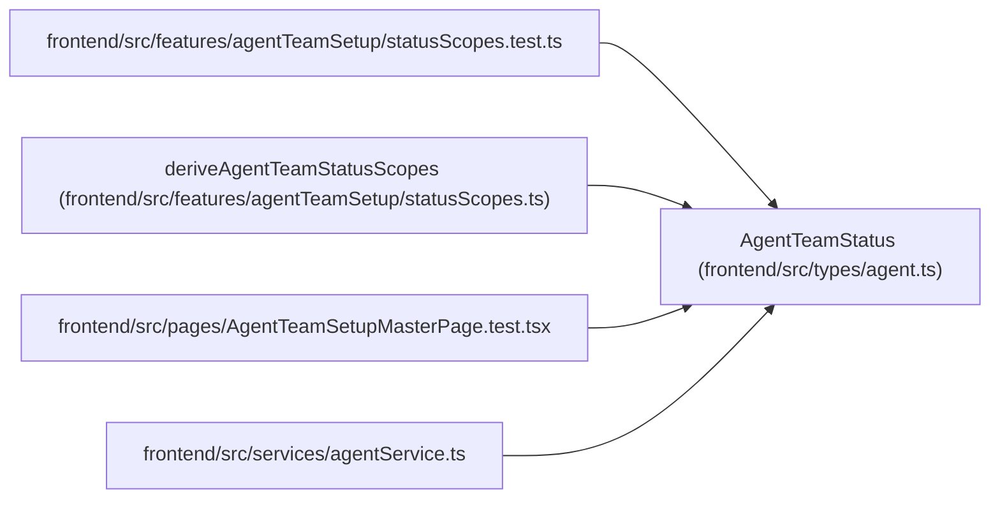

# AgentTeamStatus

**Location:** `frontend/src/types/agent.ts:805`
**Kind:** Class
**Bases:** —
**Module:** [types_agent](../modules/types_agent.md)

## Description

_Auto-generated from `AgentTeamStatus` in `frontend/src/types/agent.ts`._

## Attributes

| Name | Type | Default | Description |
|------|------|---------|-------------|
| `schema_version` | `'agent-team-status-v1'` | *required* | — |
| `topology_key` | `string \| null` | *required* | — |
| `topology_revision` | `number \| null` | *required* | — |
| `manifest_digest` | `string \| null` | *required* | — |
| `topology_state` | `'absent' \| 'configured' \| 'onboarding' \| 'runtime_ready' \| 'blocked' \| 'disabled'` | *required* | — |
| `runtime_ready` | `boolean` | *required* | — |
| `availability` | `'availability_unknown'` | *required* | — |
| `blocker_codes` | `string[]` | *required* | — |
| `steps` | `AgentTeamSetupStep[]` | *required* | — |
| `members` | `AgentTeamMemberStatus[]` | *required* | — |
| `pending_action_ids` | `string[]` | *required* | — |
| `can_mutate` | `boolean` | *required* | — |
| `next_action` | `string \| null` | *required* | — |

## Methods

*No public methods. Inherits from base classes.*

## Relationships

<!-- Auto-generated relationship summary. Do not edit by hand. -->

### Summary

| Module | Methods | Attributes |
|---|---:|---|
| [types_agent](../modules/types_agent.md) | 0 | `availability`, `blocker_codes`, `can_mutate`, `manifest_digest`, `members`, `next_action`, `pending_action_ids`, `runtime_ready`, `schema_version`, `steps`, `topology_key`, `topology_revision` |

### References

| Reference | Kind | Source | Call sites |
|---|---|---|---:|
| `statusScopes.test` | import | [statusScopes.test](../modules/statusScopes.test.md) | — |
| `deriveAgentTeamStatusScopes` | type_reference | [statusScopes](../modules/statusScopes.md) | — |
| `AgentTeamSetupMasterPage.test` | import | [AgentTeamSetupMasterPage.test](../modules/AgentTeamSetupMasterPage.test.md) | — |
| `agentService` | import | [agentService](../modules/agentService.md) | — |
