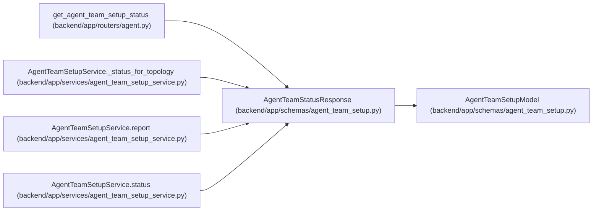

# AgentTeamStatusResponse

**Location:** `backend/app/schemas/agent_team_setup.py:941`
**Kind:** Pydantic model
**Bases:** `AgentTeamSetupModel`
**Module:** [agent_team_setup](../modules/agent_team_setup.md)

## Description

_Auto-generated from `AgentTeamStatusResponse` in `backend/app/schemas/agent_team_setup.py`._

## Attributes

| Name | Type | Wire name | Required | Nullable | Default | Constraints | Examples | Description |
|------|------|-----------|----------|----------|---------|-------------|-------------|----------|
| `schema_version` | `Literal['agent-team-status-v1']` | `schema_version` | No | No | `AGENT_TEAM_STATUS_SCHEMA_VERSION` | — | — | — |
| `topology_key` | `str \| None` | `topology_key` | No | Yes | `None` | pattern=unknown (STABLE_KEY_PATTERN) | — | — |
| `topology_revision` | `int \| None` | `topology_revision` | No | Yes | `None` | ge=1 | — | — |
| `manifest_digest` | `str \| None` | `manifest_digest` | No | Yes | `None` | pattern=unknown (SHA256_PATTERN) | — | — |
| `topology_state` | `Literal['absent', 'configured', 'onboarding', 'runtime_ready', 'blocked', 'disabled']` | `topology_state` | Yes | No | — | — | — | — |
| `runtime_ready` | `bool` | `runtime_ready` | Yes | No | — | — | — | — |
| `availability` | `Literal['availability_unknown']` | `availability` | No | No | `'availability_unknown'` | — | — | — |
| `blocker_codes` | `tuple[str, ...]` | `blocker_codes` | No | No | `()` | max_length=unknown (MAX_AGENT_TEAM_BLOCKERS) | — | — |
| `steps` | `tuple[AgentTeamSetupStep, ...]` | `steps` | Yes | No | — | max_length=7 | — | — |
| `members` | `tuple[AgentTeamMemberStatus, ...]` | `members` | No | No | `()` | max_length=unknown (MAX_AGENT_TEAM_MEMBERS) | — | — |
| `pending_action_ids` | `tuple[str, ...]` | `pending_action_ids` | No | No | `()` | max_length=unknown (MAX_AGENT_TEAM_ACTIONS) | — | — |
| `can_mutate` | `bool` | `can_mutate` | Yes | No | — | — | — | — |
| `next_action` | `str \| None` | `next_action` | No | Yes | `None` | max_length=255 | — | — |

## Methods

*No public methods. Inherits from base classes.*

## Relationships

<!-- Auto-generated relationship summary. Do not edit by hand. -->

### Summary

| Module | Methods | Attributes |
|---|---:|---|
| [agent_team_setup](../modules/agent_team_setup.md) | 0 | `availability`, `blocker_codes`, `can_mutate`, `manifest_digest`, `members`, `next_action`, `pending_action_ids`, `runtime_ready`, `schema_version`, `steps`, `topology_key`, `topology_revision` |

### Structure

| Kind | Entity | Module |
|---|---|---|
| Base | `AgentTeamSetupModel` | [agent_team_setup](../modules/agent_team_setup.md) |

### References

| Reference | Kind | Source | Call sites |
|---|---|---|---:|
| `get_agent_team_setup_status` | type_reference | [routers_agent](../modules/routers_agent.md) | — |
| `AgentTeamSetupService._status_for_topology` | call | [agent_team_setup_service](../modules/agent_team_setup_service.md) | 1 |
| `AgentTeamSetupService._status_for_topology` | type_reference | [agent_team_setup_service](../modules/agent_team_setup_service.md) | — |
| `AgentTeamSetupService.report` | call | [agent_team_setup_service](../modules/agent_team_setup_service.md) | 1 |
| `AgentTeamSetupService.status` | call | [agent_team_setup_service](../modules/agent_team_setup_service.md) | 1 |
| `AgentTeamSetupService.status` | type_reference | [agent_team_setup_service](../modules/agent_team_setup_service.md) | — |
