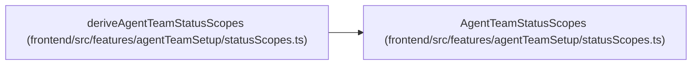

# AgentTeamStatusScopes

**Location:** `frontend/src/features/agentTeamSetup/statusScopes.ts:23`
**Kind:** Class
**Bases:** —
**Module:** [statusScopes](../modules/statusScopes.md)

## Description

_Auto-generated from `AgentTeamStatusScopes` in `frontend/src/features/agentTeamSetup/statusScopes.ts`._

## Attributes

| Name | Type | Default | Description |
|------|------|---------|-------------|
| `topology` | `TopologyConfigurationState` | *required* | — |
| `authority` | `SessionAuthorityState` | *required* | — |
| `runtime` | `RuntimeReadinessState` | *required* | — |

## Methods

*No public methods. Inherits from base classes.*

## Relationships

<!-- Auto-generated relationship summary. Do not edit by hand. -->

### Summary

| Module | Methods | Attributes |
|---|---:|---|
| [statusScopes](../modules/statusScopes.md) | 0 | `authority`, `runtime`, `topology` |

### References

| Reference | Kind | Source | Call sites |
|---|---|---|---:|
| `deriveAgentTeamStatusScopes` | type_reference | [statusScopes](../modules/statusScopes.md) | — |
