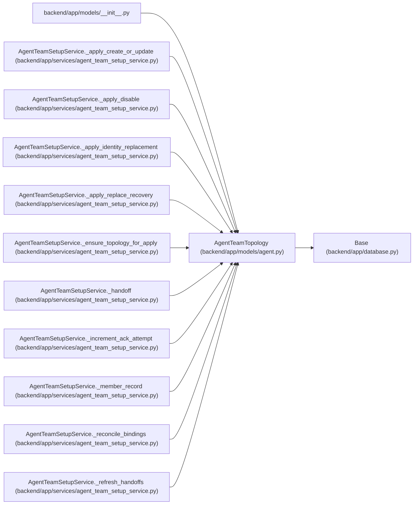

# AgentTeamTopology

**Location:** `backend/app/models/agent.py:284`
**Kind:** Class
**Bases:** `Base`
**Module:** [models_agent](../modules/models_agent.md)

## Description

Applied portable agent-team manifest and authoritative readiness state.

## Attributes

| Name | Type | Default | Description |
|------|------|---------|-------------|
| `id` | `Mapped[int]` | `mapped_column(Integer, primary_key=True, autoincrement=True)` | — |
| `topology_key` | `Mapped[str]` | `mapped_column(String(100), unique=True, nullable=False)` | — |
| `revision` | `Mapped[int]` | `mapped_column(Integer, default=1, nullable=False)` | — |
| `manifest_digest` | `Mapped[str]` | `mapped_column(String(64), nullable=False)` | — |
| `manifest_payload` | `Mapped[str]` | `mapped_column(Text, nullable=False)` | — |
| `primary_actor_id` | `Mapped[Optional[int]]` | `mapped_column(Integer, ForeignKey('agent_actors.id', ondelete='RESTRICT'), unique=True, nullable=True)` | — |
| `state` | `Mapped[str]` | `mapped_column(String(30), default='configured', nullable=False)` | — |
| `blocker_codes` | `Mapped[str]` | `mapped_column(Text, default='[]', nullable=False)` | — |
| `created_at` | `Mapped[datetime]` | `mapped_column(UTCDateTime(), default=utc_now, nullable=False)` | — |
| `updated_at` | `Mapped[datetime]` | `mapped_column(UTCDateTime(), default=utc_now, onupdate=utc_now, nullable=False)` | — |
| `primary_actor` | `Mapped[Optional['AgentActor']]` | `relationship('AgentActor', foreign_keys=[primary_actor_id])` | — |
| `members` | `Mapped[list['AgentTeamTopologyMember']]` | `relationship('AgentTeamTopologyMember', back_populates='topology', passive_deletes=True, order_by='AgentTeamTopologyMember.actor_key')` | — |
| `managed_objects` | `Mapped[list['AgentTeamManagedObject']]` | `relationship('AgentTeamManagedObject', back_populates='topology', passive_deletes=True)` | — |
| `apply_runs` | `Mapped[list['AgentTeamApplyRun']]` | `relationship('AgentTeamApplyRun', back_populates='topology', passive_deletes=True)` | — |

## Methods

*No public methods. Inherits from base classes.*

## Relationships

<!-- Auto-generated relationship summary. Do not edit by hand. -->

### Summary

| Module | Methods | Attributes |
|---|---:|---|
| [models_agent](../modules/models_agent.md) | 0 | `apply_runs`, `blocker_codes`, `created_at`, `id`, `managed_objects`, `manifest_digest`, `manifest_payload`, `members`, `primary_actor`, `primary_actor_id`, `revision`, `state` |

### Structure

| Kind | Entity | Module |
|---|---|---|
| Base | `Base` | [app_database](../modules/app_database.md) |

### References

| Reference | Kind | Source | Call sites |
|---|---|---|---:|
| `__init__` | import | [models___init__](../modules/models___init__.md) | — |
| `AgentTeamSetupService._apply_create_or_update` | type_reference | [agent_team_setup_service](../modules/agent_team_setup_service.md) | — |
| `AgentTeamSetupService._apply_disable` | type_reference | [agent_team_setup_service](../modules/agent_team_setup_service.md) | — |
| `AgentTeamSetupService._apply_identity_replacement` | type_reference | [agent_team_setup_service](../modules/agent_team_setup_service.md) | — |
| `AgentTeamSetupService._apply_replace_recovery` | type_reference | [agent_team_setup_service](../modules/agent_team_setup_service.md) | — |
| `AgentTeamSetupService._ensure_topology_for_apply` | call | [agent_team_setup_service](../modules/agent_team_setup_service.md) | 1 |
| `AgentTeamSetupService._ensure_topology_for_apply` | type_reference | [agent_team_setup_service](../modules/agent_team_setup_service.md) | — |
| `AgentTeamSetupService._handoff` | type_reference | [agent_team_setup_service](../modules/agent_team_setup_service.md) | — |
| `AgentTeamSetupService._increment_ack_attempt` | type_reference | [agent_team_setup_service](../modules/agent_team_setup_service.md) | — |
| `AgentTeamSetupService._member_record` | type_reference | [agent_team_setup_service](../modules/agent_team_setup_service.md) | — |
| `AgentTeamSetupService._reconcile_bindings` | type_reference | [agent_team_setup_service](../modules/agent_team_setup_service.md) | — |
| `AgentTeamSetupService._refresh_handoffs` | type_reference | [agent_team_setup_service](../modules/agent_team_setup_service.md) | — |

> References: showing 12 of 18 logical references; 6 omitted by the 12-row generated summary limit.
