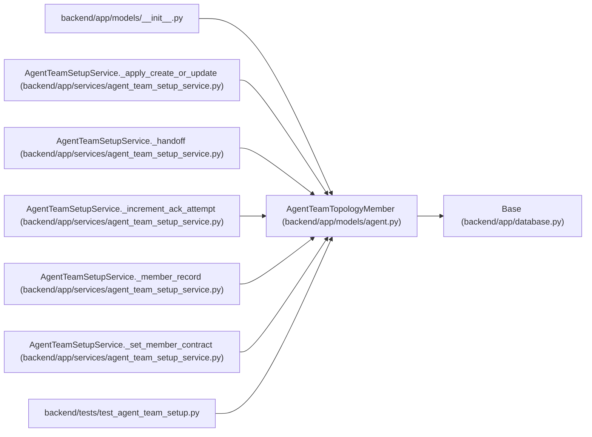

# AgentTeamTopologyMember

**Location:** `backend/app/models/agent.py:356`
**Kind:** Class
**Bases:** `Base`
**Module:** [models_agent](../modules/models_agent.md)

## Description

Installation-local mapping from a portable actor key to one actor.

## Attributes

| Name | Type | Default | Description |
|------|------|---------|-------------|
| `id` | `Mapped[int]` | `mapped_column(Integer, primary_key=True, autoincrement=True)` | — |
| `topology_id` | `Mapped[int]` | `mapped_column(Integer, ForeignKey('agent_team_topologies.id', ondelete='RESTRICT'), nullable=False)` | — |
| `actor_key` | `Mapped[str]` | `mapped_column(String(100), nullable=False)` | — |
| `actor_id` | `Mapped[Optional[int]]` | `mapped_column(Integer, ForeignKey('agent_actors.id', ondelete='RESTRICT'), nullable=True)` | — |
| `actor_name` | `Mapped[str]` | `mapped_column(String(100), nullable=False)` | — |
| `role` | `Mapped[str]` | `mapped_column(String(30), nullable=False)` | — |
| `object_revision` | `Mapped[int]` | `mapped_column(Integer, default=1, nullable=False)` | — |
| `lifecycle_state` | `Mapped[str]` | `mapped_column(String(40), default='desired', nullable=False)` | — |
| `desired_member_digest` | `Mapped[str]` | `mapped_column(String(64), nullable=False)` | — |
| `desired_member_payload` | `Mapped[str]` | `mapped_column(Text, nullable=False)` | — |
| `scope_preset` | `Mapped[str]` | `mapped_column(String(40), nullable=False)` | — |
| `profile_key` | `Mapped[str]` | `mapped_column(String(120), nullable=False)` | — |
| `skill_package_name` | `Mapped[str]` | `mapped_column(String(120), nullable=False)` | — |
| `skill_package_version` | `Mapped[str]` | `mapped_column(String(40), nullable=False)` | — |
| `skill_package_checksum` | `Mapped[str]` | `mapped_column(String(64), nullable=False)` | — |
| `model_binding_keys` | `Mapped[str]` | `mapped_column(Text, nullable=False)` | — |
| `default_model_binding_key` | `Mapped[str]` | `mapped_column(String(120), nullable=False)` | — |
| `assignment_modes` | `Mapped[str]` | `mapped_column(Text, nullable=False)` | — |
| `runtime_ref` | `Mapped[str]` | `mapped_column(String(1024), nullable=False)` | — |
| `credential_ref` | `Mapped[str]` | `mapped_column(String(1024), nullable=False)` | — |
| `credential_delivery_state` | `Mapped[str]` | `mapped_column(String(30), default='pending', nullable=False)` | — |
| `credential_delivery_receipt_digest` | `Mapped[Optional[str]]` | `mapped_column(String(64), nullable=True)` | — |
| `handoff_digest` | `Mapped[Optional[str]]` | `mapped_column(String(64), nullable=True)` | — |
| `runtime_acknowledgement_digest` | `Mapped[Optional[str]]` | `mapped_column(String(64), nullable=True)` | — |
| `runtime_acknowledgement_payload` | `Mapped[Optional[str]]` | `mapped_column(Text, nullable=True)` | — |
| `runtime_acknowledged_at` | `Mapped[Optional[datetime]]` | `mapped_column(UTCDateTime(), nullable=True)` | — |
| `ack_attempt_count` | `Mapped[int]` | `mapped_column(Integer, default=0, nullable=False)` | — |
| `ack_window_started_at` | `Mapped[Optional[datetime]]` | `mapped_column(UTCDateTime(), nullable=True)` | — |
| `created_at` | `Mapped[datetime]` | `mapped_column(UTCDateTime(), default=utc_now, nullable=False)` | — |
| `updated_at` | `Mapped[datetime]` | `mapped_column(UTCDateTime(), default=utc_now, onupdate=utc_now, nullable=False)` | — |
| `topology` | `Mapped['AgentTeamTopology']` | `relationship('AgentTeamTopology', back_populates='members')` | — |
| `actor` | `Mapped[Optional['AgentActor']]` | `relationship('AgentActor', foreign_keys=[actor_id])` | — |

## Methods

*No public methods. Inherits from base classes.*

## Relationships

<!-- Auto-generated relationship summary. Do not edit by hand. -->

### Summary

| Module | Methods | Attributes |
|---|---:|---|
| [models_agent](../modules/models_agent.md) | 0 | `ack_attempt_count`, `ack_window_started_at`, `actor`, `actor_id`, `actor_key`, `actor_name`, `assignment_modes`, `created_at`, `credential_delivery_receipt_digest`, `credential_delivery_state`, `credential_ref`, `default_model_binding_key` |

### Structure

| Kind | Entity | Module |
|---|---|---|
| Base | `Base` | [app_database](../modules/app_database.md) |

### References

| Reference | Kind | Source | Call sites |
|---|---|---|---:|
| `__init__` | import | [models___init__](../modules/models___init__.md) | — |
| `AgentTeamSetupService._apply_create_or_update` | call | [agent_team_setup_service](../modules/agent_team_setup_service.md) | 2 |
| `AgentTeamSetupService._handoff` | type_reference | [agent_team_setup_service](../modules/agent_team_setup_service.md) | — |
| `AgentTeamSetupService._increment_ack_attempt` | type_reference | [agent_team_setup_service](../modules/agent_team_setup_service.md) | — |
| `AgentTeamSetupService._member_record` | type_reference | [agent_team_setup_service](../modules/agent_team_setup_service.md) | — |
| `AgentTeamSetupService._set_member_contract` | type_reference | [agent_team_setup_service](../modules/agent_team_setup_service.md) | — |
| `test_agent_team_setup` | import | [test_agent_team_setup](../modules/test_agent_team_setup.md) | — |
